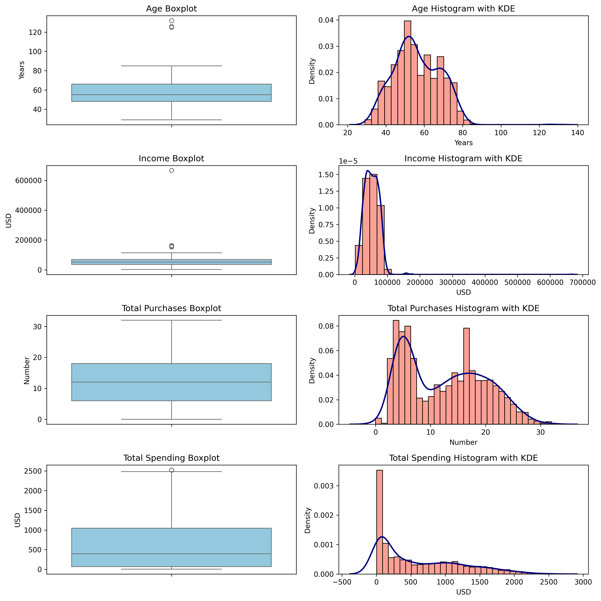
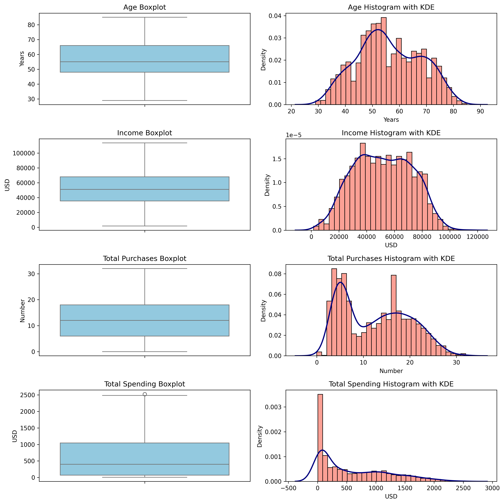
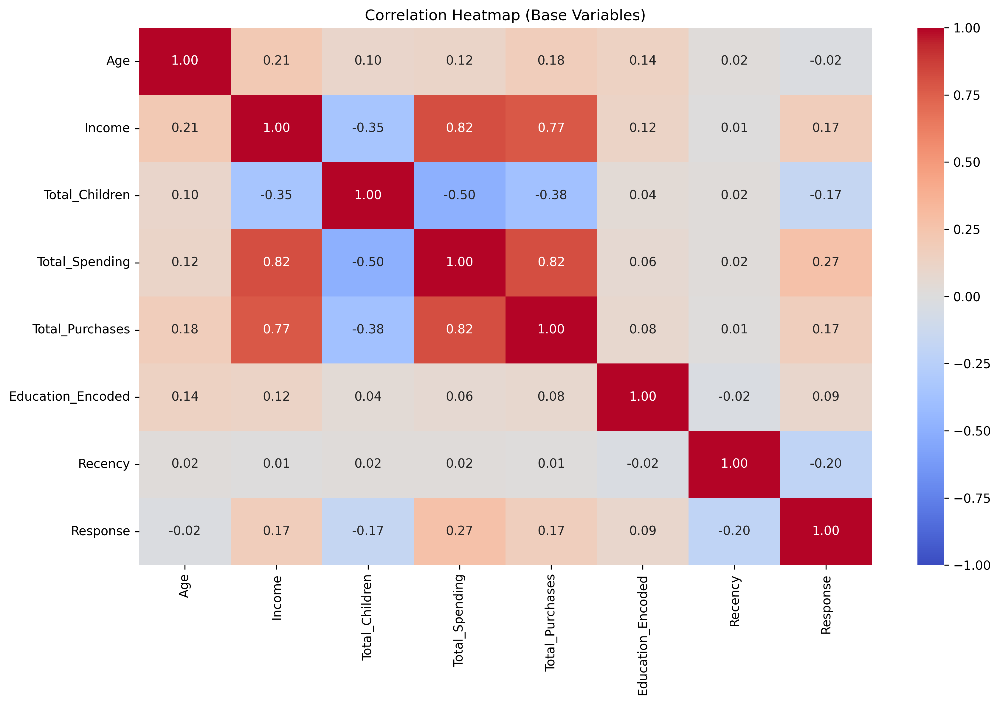
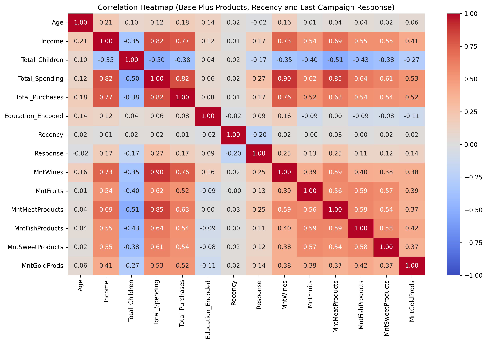
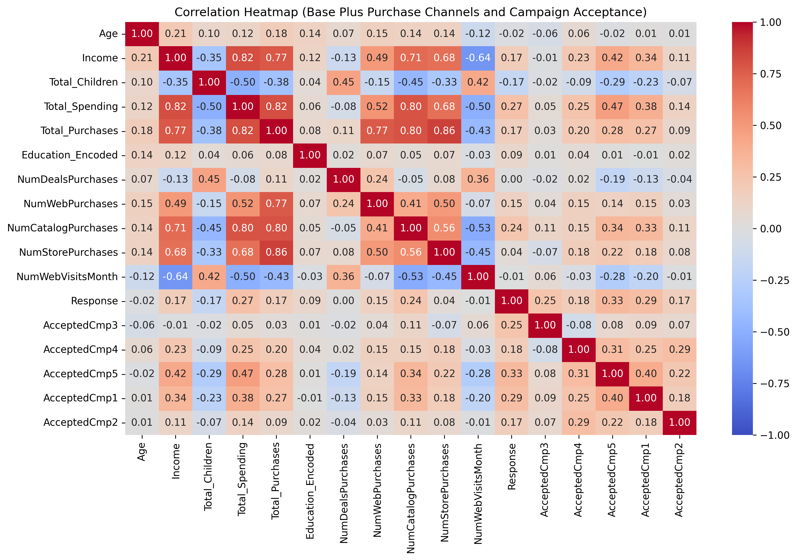

# Marketing Campaign Analysis

## Marketing Campaign Analysis - Exploratory Data Analysis, Hypothesis Testing and Additional Visualizations

The complete set of notebooks performs exploratory data analysis and hypothesis testing on marketing campaign data to understand customer acquisition factors. The summarized results for EDA are presented below. The hypothesis testing and additional visualizations are in separate notebooks. Together, these 3 notebooks provide the results of comprehensive analysis of the marketing campaign data.

### Summary Notebooks

1. 01_marketing_campaign_analysis.ipynb - Exploratory Data Analysis
2. 09_step_7_hypothesis_testing.ipynb - Hypothesis Testing
3. 14_step_8_additional_visualizations.ipynb - Additional Visualizations

### Working Notebooks

Please refer to the individual notebooks for detailed analysis, code, and visualizations.

- EDA Notebooks:
  - 02_step_0_load_and_investigate_the_data.ipynb
  - 03_step_1_examine_dt_customer_and_income.ipynb
  - 04_step_2_missing_value_imputation.ipynb
  - 05_step_3_feature_engineering.ipynb
  - 06_step_4_visualizations_box_plots_histograms_and_den.ipynb
  - 07_step_5_encoding_categorical_variables.ipynb
  - 08_step_6_correlation_heatmap.ipynb
- Hypothesis Testing Notebooks:
  - 10_older_individuals_prefer_in_store_shopping.ipynb
  - 11_customers_with_children_prefer_online_shopping.ipynb
  - 12_store_sales_cannibalization_by_alternative_distrib.ipynb
  - 13_us_versus_the_rest_of_the_world_in_total_purchases.ipynb
- Additional Visualizations Notebooks:
  - 15_identify_the_top_performing_products_and_those_wit.ipynb
  - 16_examine_if_there_is_a_correlation_between_customer.ipynb
  - 17_determine_the_country_with_the_highest_number_of_c.ipynb
  - 18_investigate_if_there_is_a_discernible_pattern_in_t.ipynb
  - 19_analyze_the_educational_background_of_customers_wh.ipynb

## Step 0: Load and Investigate the Data

- Load the data
- Fix the Income column name to remove the spaces in the column name

**Data columns (total 28 columns):**

|#   |Column              |Non-Null Count |Dtype|
|----|--------------------|---------------|-----|
|0   |ID                  |2240 non-null  |int64|
|1   |Year_Birth          |2240 non-null  |int64|
|2   |Education           |2240 non-null  |object|
|3   |Marital_Status      |2240 non-null  |object|
|4   |Income              |2216 non-null  |object|
|5   |Kidhome             |2240 non-null  |int64|
|6   |Teenhome            |2240 non-null  |int64|
|7   |Dt_Customer         |2240 non-null  |object|
|8   |Recency             |2240 non-null  |int64|
|9   |MntWines            |2240 non-null  |int64|
|10  |MntFruits           |2240 non-null  |int64|
|11  |MntMeatProducts     |2240 non-null  |int64|
|12  |MntFishProducts     |2240 non-null  |int64|
|13  |MntSweetProducts    |2240 non-null  |int64|
|14  |MntGoldProds        |2240 non-null  |int64|
|15  |NumDealsPurchases   |2240 non-null  |int64|
|16  |NumWebPurchases     |2240 non-null  |int64|
|17  |NumCatalogPurchases |2240 non-null  |int64|
|18  |NumStorePurchases   |2240 non-null  |int64|
|19  |NumWebVisitsMonth   |2240 non-null  |int64|
|20  |AcceptedCmp3        |2240 non-null  |int64|
|21  |AcceptedCmp4        |2240 non-null  |int64|
|22  |AcceptedCmp5        |2240 non-null  |int64|
|23  |AcceptedCmp1        |2240 non-null  |int64|
|24  |AcceptedCmp2        |2240 non-null  |int64|
|25  |Response            |2240 non-null  |int64|
|26  |Complain            |2240 non-null  |int64|
|27  |Country             |2240 non-null  |object|

---

## Step 1: Examine Dt_Customer and Income

- Converting Dt_Customer to datetime
- Cleaning Income Column

## Step 2: Missing Value Imputation

## Data Cleaning

The instructions emphasize cleaning the Education and Marital Status categories and use those categories for Income Value Imputation.

### Here’s how cleansing the Education values was undertaken

- The presence of 2n Cycle alongside Master suggests potential redundancy, as both likely refer to postgraduate education. Basic is vague and may need clarification or standardization.
  - Merge 2n Cycle with Master: Since 2n Cycle corresponds to a Master’s degree in the Bologna Process, combining it with Master standardizes the category to a more universally recognized term.
- Clarify Basic: Without additional context, Basic likely represents education below a Bachelor’s degree
  - (e.g., high school or less). It will be renamed to something clearer: "Secondary"
- Retain Graduation and rename to Bachelor

### Original Education values

|Value         |Count|
|--------------|-----|
|Graduation    |1127|
|PhD            |486|
|Master         |370|
|2n Cycle       |203|
|Basic           |54|

### Cleaned Education values

|Value         |Count|
|--------------|-----|
|Bachelor     |1127|
|Master        |573|
|PhD           |486|
|Secondary      |54|

### The cleaning process used for merging non-standard categories in the Marital Status column

- Merge (YOLO, Alone, Absurd) into a standard one (Single), reducing redundancy:
  - YOLO (2 entries): Likely a joke or informal entry implying a single. Merging into Single.
  - Alone (3 entries): Implies no partner, aligning with Single. Merging into Single.
  - Absurd (2 entries): Ambiguous, but with such low frequency, it’s likely an error or non-standard
- Retain Married, Together, Divorced, and Widow as distinct categories, as they reflect standard marital statuses.
  - Married: 864 (standard, refers to legally married individuals)
  - Together: 580 (likely refers to cohabiting partners, not legally married)
  - Divorced: 232 (standard, refers to legally divorced individuals)
  - Widow: 77 (standard, refers to individuals whose spouse has passed away)

### Original Marital Status values

|Value      |Count|
|-----------|-----|
|Married    | 864|
|Together   | 580|
|Single     | 480|
|Divorced   | 232|
|Widow      | 77|
|Alone      | 3|
|YOLO       | 2|
|Absurd     | 2|

### Cleaned Marital_Status values

|Value       |Count|
|------------|-----|
|Married     | 864|
|Together    | 580|
|Single      | 487|
|Divorced    | 232|
|Widow      | 77|

### Calculate mean and median income by Marital Status and Education

**Mean Income Pivot Table:**

|Marital_Status |Bachelor    |Master       |PhD         |Secondary   |
|----------------|------------|-------------|------------|------------|
|Divorced        |54526.04   |49972.83    |53096.62   |9548.00    |
|Married         |50800.26   |50686.06    |58138.03   |21960.50   |
|Single          |51365.63   |53751.08    |53039.67   |18238.67   |
|Together        |55758.48   |49495.94    |56041.42   |21240.07   |
|Widow           |54976.66   |56211.12    |60288.08   |22123.00   |

**Median Income Pivot Table:**

| Marital_Status       | Bachelor   | Master      | PhD       | Secondary  |
|-----------------|------------|-------------|-----------|------------|
| Divorced        | 55635.00   | 49297.00    | 50613.50  | 9548.00    |
| Married         | 50737.00   | 50017.00    | 57081.50  | 22352.00   |
| Single          | 49973.50   | 49514.00    | 48918.00  | 16383.00   |
| Together       | 53977.00   | 47586.50    | 56756.00  | 23179.00   |
| Widow          | 58275.00   | 51459.50    | 57032.00  | 22123.00   |

### Missing Value Imputation

**Basic Statistical Data for Income column:**

|Statistic | Value      |
|----------|-----------|
|count      |2216.00|
|mean      |52247.25|
|std       |25173.08|
|min        |1730.00|
|25%       |35303.00|
|50%       |51381.50|
|75%       |68522.00|
|max       |666666.00|
|skew      | 6.76      |
|NaN count | 24        |

The skewness value of 6.76 indicates extremely high positive skewness in income distribution

- Mean income will be substantially higher than median income
- Standard deviation may not accurately represent typical variation
- The bulk of data points cluster at lower income levels
- Use median instead of mean as a measure of central tendency

**Conclusion**: Impute missing Income values using the median income for the appropriate Education and Maritial_Status categories

### Basic Statistical Data for Income column after imputation

| Statistic | Value      |
|-----------|------------|
| count     | 2240.00    |
| mean      | 52229.62   |
| std       | 25040.06   |
| min       | 1730.00    |
| 25%       | 35538.75   |
| 50%       | 51222.50   |
| 75%       | 68289.75   |
| max       | 666666.00  |

Notice the count value has increased from 2216 to 2240 which has also altered the _overall_ mean and median

### Median Income Pivot Table After Imputation

|Marital_Status  |Bachelor   |Master      |PhD        |Secondary  |
|----------------|-----------|------------|-----------|-----------|
|Divorced        |55635.00   |49297.00    |50613.50   |9548.00    |
|Married         |50737.00   |50017.00    |57081.50   |22352.00   |
|Single          |49973.50   |49514.00    |48918.00   |16383.00   |
|Together        |53977.00   |47586.50    |56756.00   |23179.00   |
|Widow           |58275.00   |51459.50    |57032.00   |22123.00   |

The categorical median has been retained as seen in the updated pivot table

## Step 3: Feature Engineering

### Create new features for Age, Total Children, Total Spending, and Total Purchases

```python
# current_year = 2025
# df['Age'] = current_year - df['Year_Birth']
# df['Total_Children'] = df['Kidhome'] + df['Teenhome']
# df['Total_Spending'] = df[['MntWines', 'MntFruits', 'MntMeatProducts',
#                          'MntFishProducts', 'MntSweetProducts',
#                          'MntGoldProds']].sum(axis=1)
#df['Total_Purchases'] = df[['NumWebPurchases', 'NumCatalogPurchases',
#                            'NumStorePurchases']].sum(axis=1)
```

## Step 4: Visualizations

### Original Plots for Age, Income, Total Purchases, Total Spending



### Outlier Calculations and Data Modification

**Formula for identifying outliers using the IQR method:**

``` python
Q1 = df[column].quantile(0.25)
Q3 = df[column].quantile(0.75)
IQR = Q3 - Q1
lower_bound = Q1 - 1.5 * IQR
upper_bound = Q3 + 1.5 * IQR
```

#### Age

##### Lower Bound: 21.0

- Number of records below Lower Bound: 0
- Number of records less than 0: 0

##### Upper Bound: 93.0

- Number of records above Upper Bound: 3
  - 132
  - 126
  - 125

#### Income

##### Lower Bound: -$13587.75

- Number of records below Lower Bound: 0
- Number of records less than 0: 0

##### Upper Bound: $117416.25

- Number of records above Upper Bound: 8
  - $157146.00
  - $160803.00
  - $666666.00
  - $162397.00
  - $157733.00
  - $153924.00
  - $156924.00
  - $157243.00

#### Total_Purchases

##### Lower Bound: -12

- Number of records below Lower Bound: 0
- Number of records less than 0: 0

##### Upper Bound: 36

- Number of records above Upper Bound: 0

#### Total_Spending

##### Lower Bound: -$1396.38

- Number of records below Lower Bound: 0
- Number of records less than 0: 0

##### Upper Bound: $2510.63

- Number of records above Upper Bound: 3
  - $2525.00
  - $2525.00
  - $2524.00

Results from the plots and outlier calculations show that for the variables Total_Purchases and Total_Spending it does not make sense to remove any outliers. While the data is skewed the outlier data is relevant.

For the variables Age and Income different results are shown.

- For Age the 3 outlier values seem to be erroneous since the ages are above 93.
  - The suggestion is to remove these rows.
- For Income 1 of the 8 values seems to be erroneous or at least drastically different than the rest of the data.
  - The suggestion is to remove the rows with Income outliers above the upper bound

### Median Income Pivot Table After Imputation Step

|Marital_Status  |Bachelor   |Master      |PhD        |Secondary  |
|----------------|-----------|------------|-----------|-----------|
|Divorced        |55635.00   |49297.00    |50613.50   |9548.00    |
|Married         |50737.00   |50017.00    |57081.50   |22352.00   |
|Single          |49973.50   |49514.00    |48918.00   |16383.00   |
|Together        |53977.00   |47586.50    |56756.00   |23179.00   |
|Widow           |58275.00   |51459.50    |57032.00   |22123.00   |

### Median Income Pivot Table After Removing Outliers

|Marital_Status  |Bachelor   |Master      |PhD        |Secondary  |
|----------------|-----------|------------|-----------|-----------|
|Divorced        |55599.00   |49476.00    |50613.50   |9548.00    |
|Married         |50737.00   |50017.00    |57072.00   |22352.00   |
|Single          |49973.50   |49514.00    |48918.00   |16383.00   |
|Together        |53977.00   |47586.50    |56575.00   |23179.00   |
|Widow           |58275.00   |51459.50    |57032.00   |22123.00   |

The categorical median has been retained after removing the outliers except for the Divorced-Bachelors category where it has gone from 55635.00 to 55599.00 as seen in the updated pivot table.

### Updated Plots for Age, Income, Total Purchases, Total Spending after Removing Outliers



### Conclusion

After removing outliers from Age and Income the box and histogram plots look more like a normal curve. However Total Purchases and Total Spending are still very heavily right skewed.

## Step 5: Encoding Categorical Variables

### Ordinal encoding for Education

``` python
education_mapping = {'Secondary': 1, 'Bachelor': 2, 'Master': 3, 'PhD': 4}
df['Education_Encoded'] = df['Education'].map(education_mapping)
df.drop(columns=['Education'],inplace=True)
```

### One-hot encoding for Marital_Status and Country

``` python
df = pd.get_dummies(df, columns=['Marital_Status', 'Country'], prefix=['Marital', 'Country'])

Index(['ID', 'Year_Birth', 'Income', 'Kidhome', 'Teenhome', 'Dt_Customer',
       'Recency', 'MntWines', 'MntFruits', 'MntMeatProducts',
       'MntFishProducts', 'MntSweetProducts', 'MntGoldProds',
       'NumDealsPurchases', 'NumWebPurchases', 'NumCatalogPurchases',
       'NumStorePurchases', 'NumWebVisitsMonth', 'AcceptedCmp3',
       'AcceptedCmp4', 'AcceptedCmp5', 'AcceptedCmp1', 'AcceptedCmp2',
       'Response', 'Complain', 'Age', 'Total_Children', 'Total_Spending',
       'Total_Purchases', 'Education_Encoded', 'Marital_Divorced',
       'Marital_Married', 'Marital_Single', 'Marital_Together',
       'Marital_Widow', 'Country_AUS', 'Country_CA', 'Country_GER',
       'Country_IND', 'Country_ME', 'Country_SA', 'Country_SP', 'Country_US'],
      dtype='object')
```

## Step 6: Correlation Heatmaps

### Base Correlation Heatmap



### Correlation Heatmap (Base Plus Products, Recency and Last Campaign Response)



### Correlation Heatmap (Base Plus Purchase Channels and Campaign Acceptance)



### Results

#### Strong Positive Correlations (0.7+)

- Income-Spending Cluster: The strongest relationships center around income and spending patterns:
  - Income ↔ Total_Spending (0.82): Higher income directly drives higher overall
  - Income ↔ Total_Purchases (0.77): Wealthier customers make more transactions
  - Total_Spending ↔ Total_Purchases (0.82): More spending correlates with more purchase events
- Product Category Interconnections: Customers who buy one premium product category tend to buy others:
  - MntWines ↔ Total_Spending (0.90): Wine purchases are the strongest predictor of total spending
  - MntMeatProducts ↔ Total_Spending (0.85): Meat products also strongly correlate with overall spending
  - Various product categories show moderate correlations (0.4-0.6), suggesting cross-category purchasing

#### Moderate Correlations (0.4-0.7)

- Purchase Channel Patterns:
  - NumCatalogPurchases ↔ Income (0.71): Higher-income customers prefer catalog shopping
  - NumWebPurchases ↔ Income (0.49): Web purchases also increase with income
  - NumStorePurchases ↔ Income (0.68): Store visits correlate with income

#### Notable Negative Correlations

- Family Structure Impact:
  - Total_Children ↔ Income (-0.35): More children correlates with lower income
  - Total_Children ↔ Total_Spending (-0.50): Families with more children spend less overall
  - NumWebVisitsMonth shows negative correlations with spending (-0.50) and purchases (-0.43):
    More web browsing without purchasing suggests price sensitivity

#### Weaker Relationships

- Campaign Response: Most campaign acceptance rates show weak correlations (0.1-0.4) with other variables, suggesting campaigns aren’t strongly tied to demographic or spending patterns.
- Recency: Shows very weak correlations across the board, indicating recent purchase timing isn’t strongly predictive of other behaviors.
