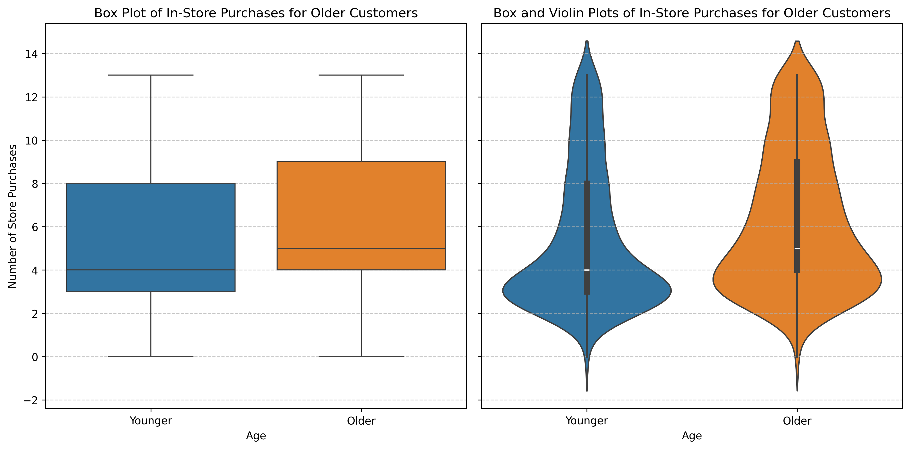
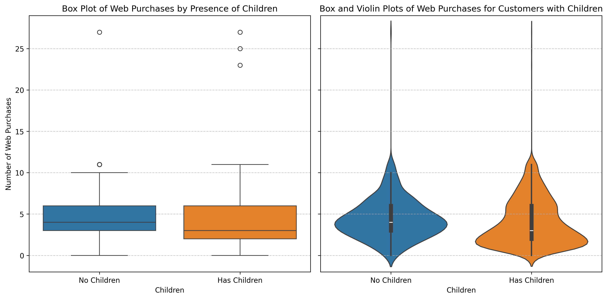
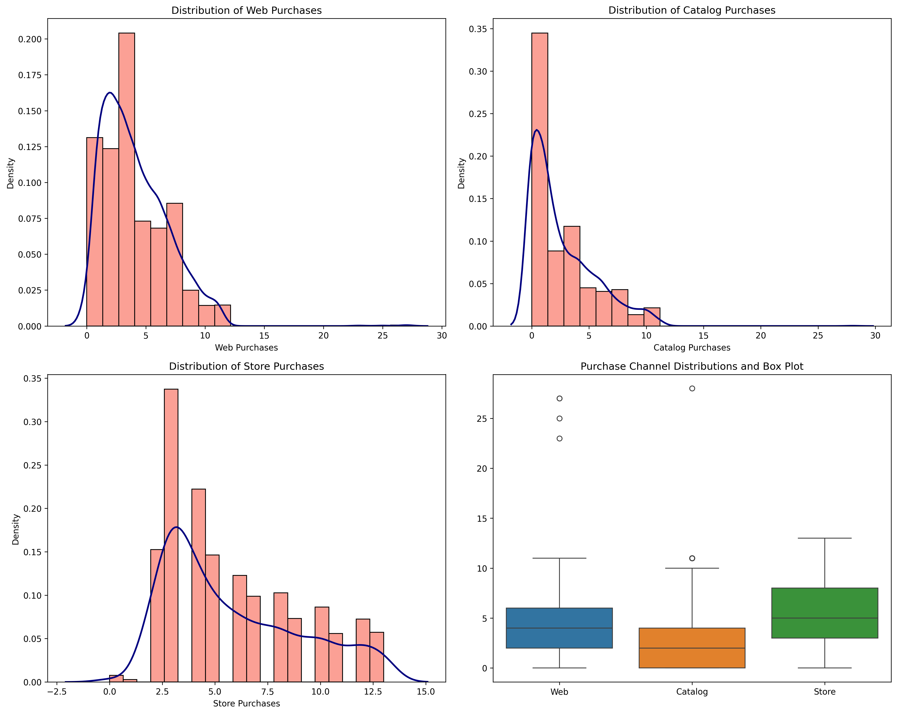
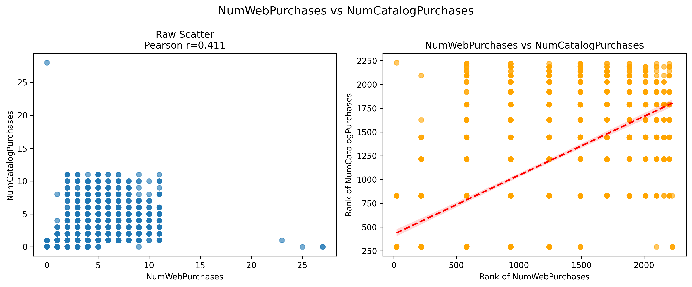
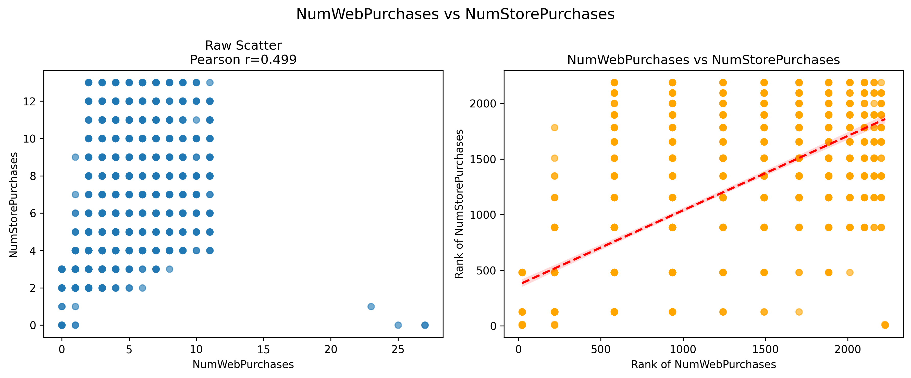
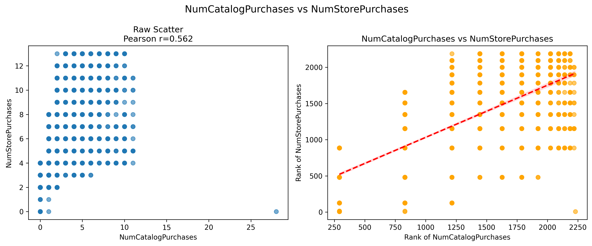
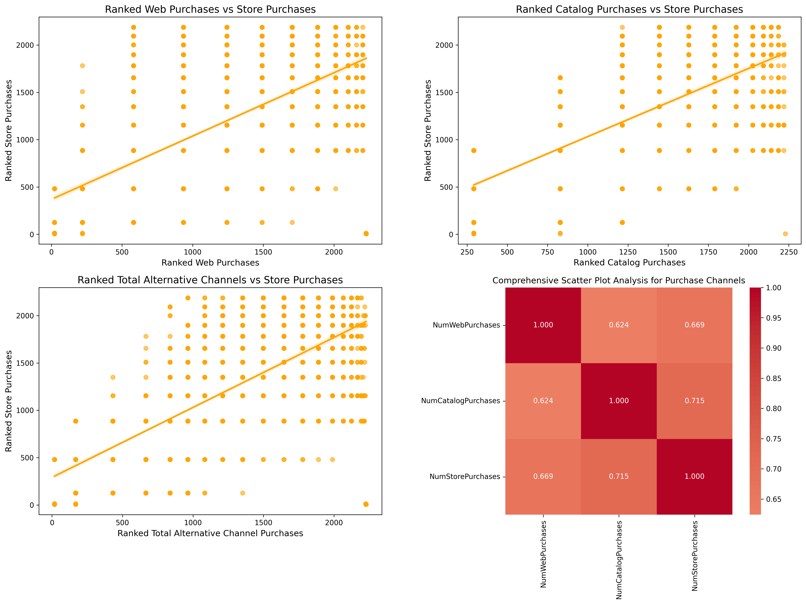
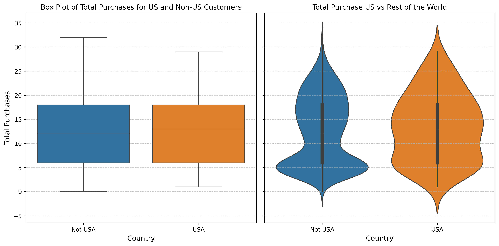

# Step 7: Hypothesis Testing

## Overview

### This section contains hypothesis testing results for the Marketing Campaign Analysis project. It encompasses the summary of key findings and insights derived from the data analysis. The actual python code used to perform the hypothesis testing can be found in the corresponding Jupyter notebooks

- 10_older_individuals_prefer_in_store_shopping.ipynb
- 11_customers_with_children_prefer_online_shopping.ipynb
- 12_store_sales_cannibalization_by_alternative_distrib.ipynb
- 13_us_versus_the_rest_of_the_world_in_total_purchases.ipynb

## a. Older individuals prefer in-store shopping

### Hypothesis Test

#### Specify H₀ and H₁

- H₀: The distributions of NumStorePurchases for older and younger customers are identical (no difference in distribution).
- H₁: The distributions of NumStorePurchases for older customers is stochastically greater (they tend to have higher values).

#### Normality and Test Choice

- Use the t-test if NumStorePurchases is approximately normally distributed.
- Use the Mann-Whitney U test if the data is non-normal.

#### Interpreting Results

- P-value ≤ α (0.05): Reject H₀, concluding there is evidence that older customers have higher in-store purchases.
- P-value > α: Fail to reject H₀, indicating insufficient evidence that older customers prefer in-store purchases.

### Results

#### Normality Tests

##### Perform Shapiro-Wilk Test

_Purpose:_

- Tests the null hypothesis (H₀) that the data from the groups is normally distributed.
- Alternative hypothesis (H₁): The data is not normally distributed.

_Shapiro-Wilk Test Results:_

- Shapiro-Wilk Test for Older Individuals = 1: p-value = 0.0000
  - p-value < 0.05: Reject H₀, data is not normally distributed.
- Shapiro-Wilk Test for Older Individuals = 0: p-value = 0.0000
  - p-value < 0.05: Reject H₀, data is not normally distributed.

##### Descriptive Statistics

| Older | mean  | median       | std  | count |
|-------|-------|--------------|------|-------|
| False | 5.359259 | 4.0          | 3.200239 | 1080 |
| True  | 6.238468 | 5.0          | 3.224830 | 1149 |

##### Visualizations



**Conclusion**: Shapiro-Wilk test and plots show data is not normally distributed so a non-parametric test seems more appropriate

---

#### Non-Parametric Test

##### Mann-Whitney U Test (One-Tailed) Results

- Mann-Whitney U Test: statistic = 735103.5000, p-value = 0.0000
  - Reject H₀: Older customers have higher in-store purchases

---

#### Parametric Tests

Parametric tests (e.g., t-tests) assume normality and homogeneity of variances.

##### Why a t-test may be ok

- Large sample sizes (e.g., n > 30 or ideally n > 50 per group), due to the Central Limit Theorem (CLT).
- The CLT states that the sampling distribution of the mean approaches normality as sample size increases, even if the underlying data is non-normal.

_Sample size for Older Customers:_

| Older | Sample Size |
|-------|-------------|
| True  | 1149        |
| False | 1080        |

##### Perform Levene's test

_Purpose:_

- Tests the null hypothesis (H₀) that the variances of the groups are equal.
- Alternative hypothesis (H₁): The variances are not equal.

_Variations of test:_

- Standard Levene’s Test: Uses the group mean for calculating deviations.
- Modified Levene’s Test (Brown-Forsythe): Uses the group median instead of the mean, which is more robust to non-normal data.

_Implications of test:_

- If Levene’s test indicates unequal variances (p-value ≤ 0.05), use Welch’s t-test to compare means.
- If variances are equal, use the standard t-test.

##### Modified Levene’s Test (Brown-Forsythe) Results

- Levene's Test: statistic = 4.1209, p-value = 0.0000
  - Unequal variances (p < 0.05)
- Unequal variances use Welch’s t-test to compare means
  - Run parametric Welch's t-test

##### Welch's t-Test (unequal variances)

- Welch's t-test: statistic = 6.4582, p-value = 0.0000
  - Reject H₀: Older customers have higher in-store purchases

---

### Conclusions

Both the parametric test (Welch's t-Test) and the non-parametric test (Mann-Whitney U Test) reject H₀, meaning there is evidence that older customers make more in-store purchases than younger customers.

---
---

## b. Customers with children prefer online shopping

### Hypothesis Test

#### Specify H₀ and H₁

- H₀: The distributions of NumWebPurchases for customers with and without children are identical (no difference in distribution).
- H₁: The distribution of NumWebPurchases for customers with children is stochastically greater (they tend to have higher values).

#### Normality and Test Choice

- Use the t-test if NumWebPurchases is approximately normally distributed.
- Use the Mann-Whitney U test if the data is non-normal.

#### Interpreting Results

- P-value ≤ α (0.05): Reject H₀, concluding there is evidence that customers with children prefer online shopping.
- P-value > α: Fail to reject H₀, indicating insufficient evidence that customers with children prefer online shopping.

### Results

#### Normality Tests

##### Perform Shapiro-Wilk Test

_Purpose:_

- Tests the null hypothesis (H₀) that the data from the groups is normally distributed.
- Alternative hypothesis (H₁): The data is not normally distributed.

_Shapiro-Wilk Test Results:_

- Shapiro-Wilk Test for Has_Children = 1: p-value = 0.0000
  - p-value < 0.05: Reject H₀, data is not normally distributed.
- Shapiro-Wilk Test for Has_Children = 0: p-value = 0.0000
  - p-value < 0.05: Reject H₀, data is not normally distributed.

##### Descriptive Statistics

| Has Children |      mean |  median |       std | count |
|--------------|-----------|---------|-----------|-------|
| False        | 4.421801  | 4.0     | 2.468273  | 633   |
| True         | 3.972431  | 3.0     | 2.879044  | 1596  |

##### Visualizations



**Conclusion**: Shapiro-Wilk test and plots show data is not normally distributed so a non-parametric test seems more appropriate

---

#### Non-Parametric Tests

##### Mann-Whitney U Test (One-Tailed) Results

- Mann-Whitney U Test: statistic = 428511.0000, p-value = 1.0000
  - Fail to reject H₀: No evidence that customers with children have higher web purchases

---

#### Parametric Tests

Parametric tests (e.g., t-tests) assume normality and homogeneity of variances.

##### Why a t-test may be ok

- Large sample sizes (e.g., n > 30 or ideally n > 50 per group), due to the Central Limit Theorem (CLT).
- The CLT states that the sampling distribution of the mean approaches normality as sample size increases, even if the underlying data is non-normal.

_Sample size for Has Children:_

| Has Children | Sample Size |
|--------------|-------------|
| True         | 1596        |
| False        | 633         |

##### Perform Levene's test

_Purpose:_

- Alternative hypothesis (H₁): The variances are not equal.

_Variations of test:_

- Standard Levene’s Test: Uses the group mean for calculating deviations.
- Modified Levene’s Test (Brown-Forsythe): Uses the group median instead of the mean, which is more robust to non-normal data.

_Implications of test:_

- If Levene’s test indicates unequal variances (p-value ≤ 0.05), use Welch’s t-test to compare means.
- If variances are equal, use the standard t-test.

##### Modified Levene’s Test (Brown-Forsythe) Results

- Levene's Test: statistic = 22.7688, p-value = 0.0000
  - Unequal variances (p < 0.05)
- Unequal variances use Welch’s t-test to compare means
  - Run parametric Welch's t-test

##### Welch's t-Test (unequal variances)

- Welch's t-test: statistic = -3.6915, p-value = 0.9999
  - Fail to reject H₀: No evidence that customers with children have higher web purchases

---

### Conclusions

Both the parametric test (Welch's t-Test) and the non-parametric test (Mann-Whitney U Test) fail to reject H₀, meaning there is no evidence that customers with children have higher web purchases.

---
---

## c. Store Sales Cannibalization by alternative distribution channels

### Hypothesis Test

#### Specify H₀ and H₁

- Test if web/catalog purchases negatively correlate with store purchases
- Cannibalization requires store purchases to decrease when others increase
- H₀: High alternative channel users buy same/more in stores
- H₁: High alternative channel users buy LESS in stores (cannibalization)

#### Normality and Test Choice

- Use the t-test if the data from the 3 purchase groups is approximately normally distributed.
- Use the Mann-Whitney U test if the data is non-normal.

#### Correlation Test Choices

- Pearson:
  - Assumes linear relationships
  - Sensitive to outliers and skewness
  - Underestimates relationships in your data
- Spearman:
  - Works with monotonic relationships
  - Robust to outliers
  - Better captures the true strength of relationships in your skewed data

#### Interpreting Results

- The analysis ensures statistical validity through:
  - Multiple testing corrections when examining several channel pairs
  - Assumption checking for parametric tests
  - Robustness checks using non-parametric alternatives

### Results

#### Normality Tests

##### Perform Shapiro-Wilk Test

_Purpose:_

- Tests the null hypothesis (H₀) that the data from the groups is normally distributed.
- Alternative hypothesis (H₁): The data is not normally distributed.

_Shapiro-Wilk Test Results:_

- Shapiro-Wilk Test for NumStorePurchases: W= 0.9020, p-value = 0.0000
  - p-value < 0.05: Reject H₀, data is not normally distributed.
- Shapiro-Wilk Test for NumWebPurchases: W= 0.8970, p-value = 0.0000
  - p-value < 0.05: Reject H₀, data is not normally distributed.
- Shapiro-Wilk Test for NumCatalogPurchases: W= 0.8417, p-value = 0.0000
  - p-value < 0.05: Reject H₀, data is not normally distributed.

##### Descriptive Statistics

|Metric|NumStorePurchases  |NumWebPurchases   |NumCatalogPurchases   |Total_Purchases   |
|------|-------------------|------------------|----------------------|------------------|
|mean  |5.81               |4.10              |2.64                  |12.55             |
|std   |3.24               |2.78              |2.80                  |7.18              |
|min   |0.00               |0.00              |0.00                  |0.00              |
|25%   |3.00               |2.00              |0.00                  |6.00              |
|50%   |5.00               |4.00              |2.00                  |12.00             |
|75%   |8.00               |6.00              |4.00                  |18.00             |
|max   |13.00              |27.00             |28.00                 |32.00             |

##### Distribution Channel Analysis



**Conclusion**: Shapiro-Wilk test and plots show data is not normally distributed so a non-parametric test seems more appropriate

---

#### Correlation Analysis

**Detailed Correlation Analysis with Visualizations:**

NumWebPurchases vs NumCatalogPurchases:

- Pearson r=0.411, p=0.0000
- Spearman r=0.624, p=0.0000



NumWebPurchases vs NumStorePurchases:

- Pearson r=0.499, p=0.0000
- Spearman r=0.669, p=0.0000



NumCatalogPurchases vs NumStorePurchases:

- Pearson r=0.562, p=0.0000
- Spearman r=0.715, p=0.0000



_Spearman vs Pearson:_

Spearman is better for this analysis for several reasons:

1. Consistently Higher Values: Spearman correlations are substantially higher across all comparisons (0.62-0.72 vs 0.41-0.56), suggesting the relationships are stronger than Pearson indicates.
2. Non-linear Relationships: The raw scatter plots show clear evidence of non-linearity - clustered, stepped patterns rather than smooth linear trends. This is particularly evident in the catalog vs store plot.
3. Outliers and Skewness: The scatter plots reveal outliers and skewed distributions that can suppress Pearson correlations but don’t affect Spearman.
4. Count Data Characteristics: Purchase counts often follow non-normal distributions making rank-based correlation more appropriate.
The ranked scatter plots on the right show much cleaner, more linear relationships, confirming that Spearman better captures the true strength of association between these purchase behaviors.

##### Comprehensive Scatter Plot Analysis for Correlation



##### Correlation Conclusion

Correlation shows positive relationships between the various purchase methods

- Strongest Relationship:
  - Catalog and store purchases show the highest correlation (Pearson r=0.56, Spearman r=0.72), suggesting customers who buy from catalogs are also likely to shop in stores.

- Moderate Relationships:
  - Web and store purchases (Pearson r=0.50, Spearman r=0.67)
  - Web and catalog purchases (Pearson r=0.41, Spearman r=0.62)

---

#### Non-Parametric Tests

##### Hypothesis Testing Based on User Behavior - High/Low

_Test 1 (Web):_

- H₀: Distribution of store purchases is stochastically larger or equal for high web users
- H₁: Distribution of store purchases is stochastically smaller for high web users

_Test 2 (Catalog):_

- H₀: Distribution of store purchases is stochastically larger or equal for high catalog users
- H₁: Distribution of store purchases is stochastically smaller for high catalog users


```python
# High and Low Users
# high_web users equates to => df['NumWebPurchases'] > df['NumWebPurchases'].median()
# high_catalog users equates to => df['NumCatalogPurchases'] > df['NumCatalogPurchases'].median()
```

##### Median Results

_Web Cannibalization Test:_

- High web users - median store purchases: 7.0
- Low web users - median store purchases: 3.0

_Catalog Cannibalization Test:_

- High catalog users - median store purchases: 8.0
- Low catalog users - median store purchases: 3.0

##### Complete cannibalization analysis with multiple comparison correction

_What Each Column Represents:_

- Original_p: Raw p-values from Mann-Whitney tests (no correction)
- Bonferroni_p: Traditional Bonferroni correction (p × number_of_tests)
- Holm_p: Holm-Bonferroni correction (sequential method)
- FDR_p: False Discovery Rate correction (Benjamini-Hochberg)

_Why You're Comparing All Methods:_ Different Conservative Levels:

- Most Conservative: Traditional Bonferroni
- Moderate: Holm-Bonferroni
- Least Conservative: FDR (Benjamini-Hochberg)

_p Values_

|Test  |Original_p  |Bonferroni_p  |Holm_p  |FDR_p  |
|--------------------------|-----------------------|---------------------|--------------------|----------------|
|Web       |       1.0           |             1.0    |         1.0       | 1.0          |
|Catalog   |       1.0           |             1.0    |         1.0       | 1.0          |

_Reject Null Hypothesis - True/False_

|Test |Significant_Original  |Significant_Bonferroni | Significant_Holm  |Significant_FDR|
|--------------------------|-----------------------|---------------------|--------------------|----------------|
|Web       |       False           |             False    |         False       | False          |
|Catalog   |       False           |             False    |         False       | False          |

### Conclusions

#### What do the results mean?

- Significant = False means "Fail to reject the null hypothesis"
- Significant = True means "Reject the null hypothesis"
- p-value < 0.05 indicates statistical significance
- p-value can't be larger than 1.0

##### Multiple Comparison Results

- All adjustment methods (Bonferroni, Holm-Bonferroni, FDR) gave identical results, confirming that:
  - Robust conclusion - findings hold under different statistical assumptions
  - No need to worry about multiple testing - results are so clear that correction doesn’t matter

##### What Can Be Concluded

- Testing for cannibalization was performed using multiple statistical approaches with different levels of conservatism. Regardless of the correction method used (Bonferroni, Holm-Bonferroni, or FDR), no evidence of cannibalization (all p-values = 1.0), providing strong evidence that alternative channels complement rather than compete with store sales.

##### Final Interpretation

- There is no statistical evidence that web or catalog purchases cannibalize store sales. In fact, customers who purchase heavily through alternative channels also tend to be heavy store shoppers, suggesting these channels work synergistically rather than competitively.

---
---

## d. US versus the rest of the world in total purchases per customer

### Hypothesis Test

#### Specify H₀ and H₁

- H₀: The distributions of Total_Puchases for US and non-US customers are identical (no difference in distribution).
- H₁: The distribution of Total_Purchases for US customers is stochastically greater (US tends to have higher Total_Purchases for its customers).

#### Normality and Test Choice

- Use the t-test if Total_Puchases is approximately normally distributed.
- Use the Mann-Whitney U test if the data is non-normal.

#### Interpreting Results

- P-value ≤ α (0.05): Reject H₀, concluding there is evidence that US has higher Total_Purchases for its customers than the rest of the world.
- P-value > α: Fail to reject H₀, indicating insufficient evidence that US has higher Total_Purchases for its customers than the rest of the world.

### Results

#### Normality Tests

##### Perform Shapiro-Wilk Test

_Purpose:_

- Tests the null hypothesis (H₀) that the data from the groups is normally distributed.
- Alternative hypothesis (H₁): The data is not normally distributed.

_Shapiro-Wilk Test Results:_

- Shapiro-Wilk Test for Country_US = 1: p-value = 0.0023
  - p-value < 0.05: Reject H₀, data is not normally distributed.
- Shapiro-Wilk Test for Country_US = 0: p-value = 0.0000
  - p-value < 0.05: Reject H₀, data is not normally distributed.

##### Descriptive Statistics

|Country is US|mean  |median  |std   |count |
|-------------|------|--------|------|------|
|False        |12.52 |12.0    |7.19  |2121  |
|True         |13.37 |13.0    |6.99  |108   |

##### Visualizations



**Conclusion**: Shapiro-Wilk test and plots show data is not normally distributed so a non-parametric test seems more appropriate

---

#### Non-Parametric Tests

##### Mann-Whitney U Test

- statistic = 122899.5000, p-value = 0.0996
  - Fail to reject H₀: No evidence that US has higher Total Purchases for its customers than the rest of the world.

---

#### Parametric Tests

Parametric tests (e.g., t-tests) assume normality and homogeneity of variances.

##### Why a t-test may be ok

- Large sample sizes (e.g., n > 30 or ideally n > 50 per group), due to the Central Limit Theorem (CLT).
- The CLT states that the sampling distribution of the mean approaches normality as sample size increases, even if the underlying data is non-normal.

_Sample size for Country:_

|Country is US| Sample Size|
|-------------|------------|
|False        |2121        |
|True         |108         |

##### Perform Levene's test

_Purpose:_

- Tests the null hypothesis (H₀) that the variances of the groups are equal.
- Alternative hypothesis (H₁): The variances are not equal.

_Variations of test:_

- Standard Levene’s Test: Uses the group mean for calculating deviations.
- Modified Levene’s Test (Brown-Forsythe): Uses the group median instead of the mean, which is more robust to non-normal data.

_Implications of test:_

- If Levene’s test indicates unequal variances (p-value ≤ 0.05), use Welch’s t-test to compare means.
- If variances are equal, use the standard t-test.

##### Modified Levene’s Test (Brown-Forsythe) Results

- Levene's Test: statistic = 1.8860, p-value = 0.1698
  - Equal variances (p >= 0.05)
- Equal variances use standard t-test to compare means
  - Run parametric t-test

##### Standard t-Test (equal variances)

- t-test: statistic = 1.2184, p-value = 0.1116
  - Fail to reject H₀: No evidence that US has higher Total Purchases for its customers than the rest of the world.

### Conclusions

Both the parametric test (Standard t-Test) and the non-parametric test (Mann-Whitney U Test) fail to reject H₀, meaning there is no evidence that Total Purchases for US customers is greater than Total Purchases for Non US Customers
