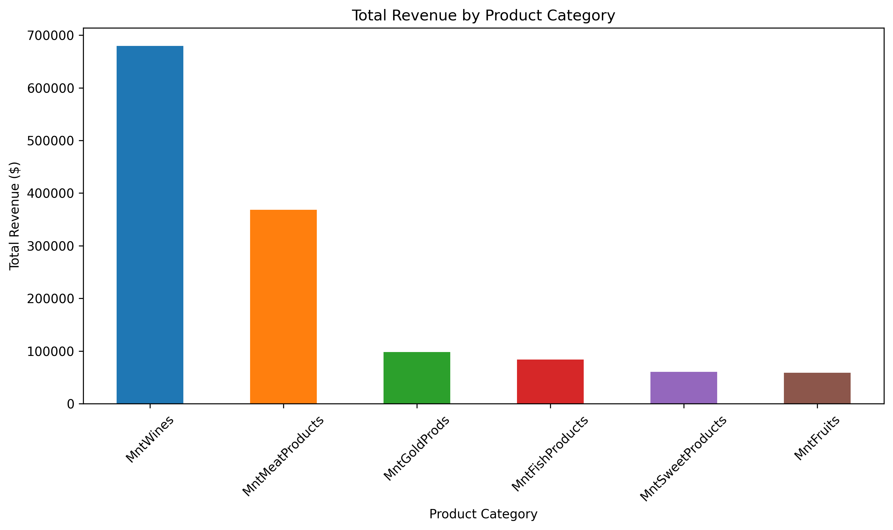
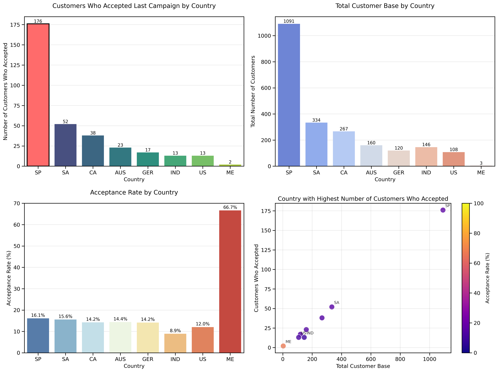
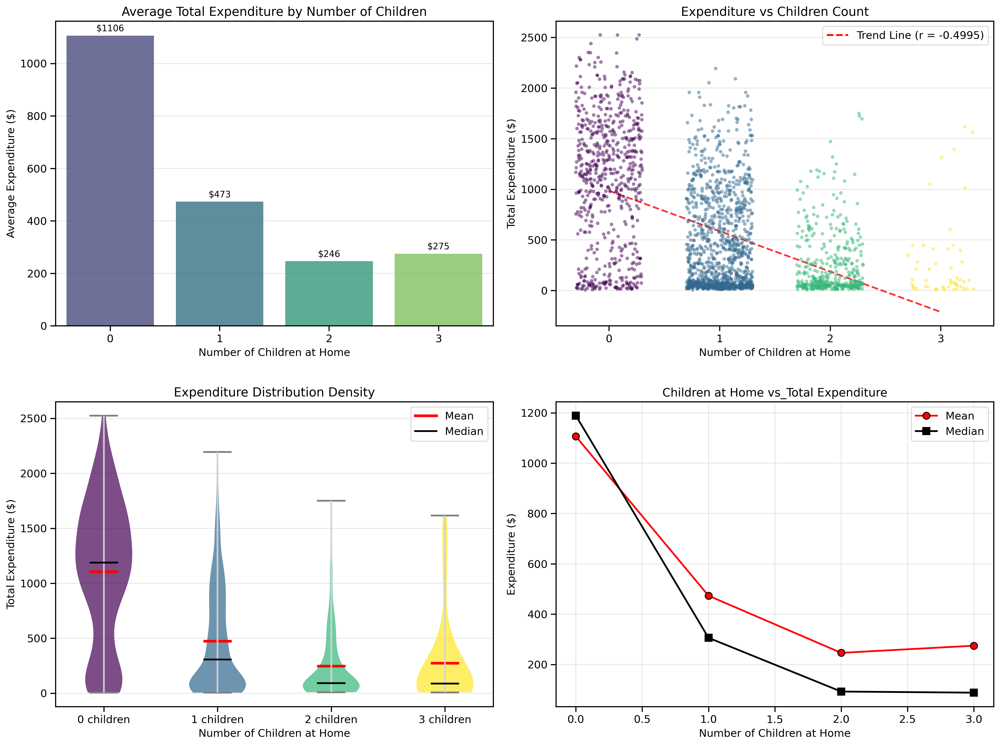
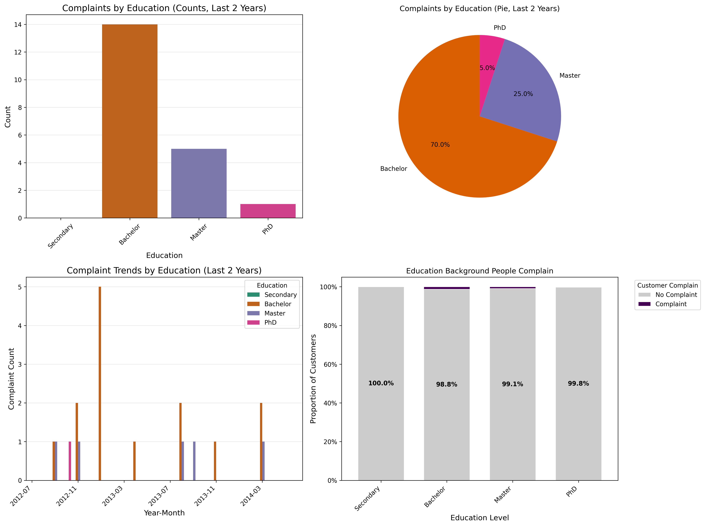

# Step 8: Additional Visualizations

## Overview

### This section contains additional visualizations for the Marketing Campaign Analysis project. It encompasses the summary of key findings and insights derived from the data analysis. The actual python code used to perform the hypothesis testing can be found in the corresponding Jupyter notebooks.

- 15_identify_the_top_performing_products_and_those_wit.ipynb
- 16_examine_if_there_is_a_correlation_between_customer.ipynb
- 17_determine_the_country_with_the_highest_number_of_c.ipynb
- 18_investigate_if_there_is_a_discernible_pattern_in_t.ipynb
- 19_analyze_the_educational_background_of_customers_wh.ipynb

## a. Identify the top-performing products and those with the lowest revenue.

### Results Visualization

---

### Key Findings

| Top-performing products | Total Revenue |
|-------------------------|---------------|
| MntWines                | 679826        |
| MntMeatProducts         | 368418        |
| MntGoldProds            | 98328         |

| Lowest-performing products | Total Revenue |
|----------------------------|---------------|
| MntFruits                  | 58731         |
| MntSweetProducts           | 60543         |
| MntFishProducts            | 83905         |

---

## b. Examine if there is a correlation between customers’ age and the acceptance rate of the last campaign

### Age Grouping and Acceptance Data for Age Groups

#### Raw Data

| Age Group | Count |
|-----------|-------|
| 50-60     | 674   |
| 40-50     | 552   |
| 60-70     | 467   |
| 70+       | 315   |
| <40       | 221   |

| Age Group | Accepted Count | Total Count | Acceptance Rate | Mean Age | Age SD | Sample Size Category |
|-----------|----------------|-------------|-----------------|----------|--------|----------------------|
| <40       | 36             | 221         | 0.163           | 36.774   | 2.631  | Small                |
| 40-50     | 84             | 552         | 0.152           | 46.293   | 2.873  | Large                |
| 50-60     | 101            | 674         | 0.150           | 55.202   | 2.847  | Large                |
| 60-70     | 63             | 467         | 0.135           | 65.694   | 2.863  | Medium               |
| 70+       | 50             | 315         | 0.159           | 74.622   | 2.992  | Small                |

#### Output

- correlation ≈ -0.019, p-value ≈ 0.372, indicating a very weak, non-significant relationship. Younger customers may have a slight tendency to accept the campaign, but the effect is negligible.
- boxplots, histogram plots, bar plot with error bars and scatter plot show no significant age to campaign acceptance relationship

---

### Results Visualization

Results and possible conclusions from intial visualizations show that age does not seem to be correlated strongly to age. This is based on the point-biserial correlation and the boxplots and histogram plots which show if anything younger customers have a slight tendency to accept the campaign. Below several other visualizations are created to explore the age versus campaign response.

---

### Key Findings

- Minimal Age Effect: The most striking finding is that age has virtually no meaningful relationship with campaign acceptance. The correlation of -0.019 is essentially zero, indicating no practical relationship between age and response rates (very weak, non-significant relationship).
- Consistent Acceptance Across Age Groups: The acceptance rates across all age groups cluster between 13-16%, with the 60-70 age group showing the lowest rate at approximately 13% and the <40 and 70+ groups showing the highest at around 16%. This 3 percentage point difference is quite small from a practical standpoint.

### Statistical Considerations

- Sample Size Reliability: The scatterplot reveals that the 60-70 age group has the smallest sample size (467), while the 50-60 group has the largest (674). The smaller sample size for the 60-70 group may contribute to the slightly lower observed acceptance rate, but the confidence intervals shown in the bar chart suggest these differences aren't statistically significant.
- Age Distribution Insights: The first chart shows that both accepted and non-accepted groups have very similar age distributions, with mean ages differing by only 0.62 years (56.2 vs 55.6). This minimal difference reinforces that age is not a meaningful predictor.

### Result

- Campaign acceptance does not seem to be correlated strongly to age.

---

## c. Determine the country with the highest number of customers who accepted the last campaign.

### Data Set Overview

- Total customers: 2,229
- Total countries: 8
- Customers who accepted last campaign: 334
- Overall acceptance rate: 14.98%

| Country | Total Customers | Accepted Customers | Acceptance Rate |
|---------|-----------------|--------------------|-----------------|
| SP      | 1091            | 176                | 16.13           |
| SA      | 334             | 52                 | 15.57           |
| CA      | 267             | 38                 | 14.23           |
| AUS     | 160             | 23                 | 14.38           |
| GER     | 120             | 17                 | 14.17           |
| IND     | 146             | 13                 | 8.90            |
| US      | 108             | 13                 | 12.04           |
| ME      | 3               | 2                  | 66.67           |

---

### Results Visualization

---

#### Detailed Insights

| Country | Total Customers | Customers Accepted | Acceptance Rate | Market Share Total | Market Share Accepted |
|---------|-----------------|--------------------|-----------------|--------------------|-----------------------|
| SP      | 1091            | 176                | 16.13           | 48.9               | 52.7                  |
| SA      | 334             | 52                 | 15.57           | 15.0               | 15.6                  |
| CA      | 267             | 38                 | 14.23           | 12.0               | 11.4                  |
| AUS     | 160             | 23                 | 14.37           | 7.2                | 6.9                   |
| GER     | 120             | 17                 | 14.17           | 5.4                | 5.1                   |
| IND     | 146             | 13                 | 8.90            | 6.6                | 3.9                   |
| US      | 108             | 13                 | 12.04           | 4.8                | 3.9                   |
| ME      | 3               | 2                  | 66.67           | 0.1                | 0.6                   |

### Key Insights

- SP leads with 176 customers accepting the campaign (52.7% of all acceptances)
- SP has 1091 total customers (48.9% of customer base)
- SP’s acceptance rate for the last campaign is 16.13% (vs 14.98% overall)
- ME with a 66.7% acceptance rate has the highest acceptance rate for the last campaign (but only 2 total acceptances vs SP’s 176)

---

## d. Investigate if there is a discernible pattern in the number of children at home and the total expenditure.

### Children at Home vs. Total Expenditure Analysis

#### Raw Data

- Total Records: 2229
- Children count range: 0 to 3
- Expenditure range: $5 to $2525

| Number Of Children | Count  | Mean    | Standard Deviation | Min | 25%   | 50%    | 75%    | Max    |
|--------------------|--------|---------|--------------------|-----|-------|--------|--------|--------|
| 0                  | 633.0  | 1106.37 | 642.97             | 6.0 | 636.0 | 1189.0 | 1587.0 | 2525.0 |
| 1                  | 1123.0 | 473.22  | 477.20             | 5.0 | 64.0  | 306.0  | 805.0  | 2194.0 |
| 2                  | 420.0  | 246.28  | 311.63             | 9.0 | 45.0  | 92.5   | 316.5  | 1750.0 |
| 3                  | 53.0   | 274.60  | 414.28             | 8.0 | 35.0  | 88.0   | 348.0  | 1616.0 |

- Pearson correlation coefficient: -0.4995
- Correlation interpretation: Moderate negative

---

### Detailed Findings and Insights

#### Summary Results

| Number Of Children | Sample Size | Average Spending | Median Spending | Standard Deviation | % of Total  Spending | Ratio |
|--------------------|-------------|------------------|-----------------|--------------------|----------------------|-------|
| 0                  | 633         | 1106.37          | 1189            | 642.97             | 28.4%                | 1.00  |
| 1                  | 1123        | 473.22           | 306.0           | 477.20             | 50.4%                | 0.43  |
| 2                  | 420         | 246.28           | 92.5            | 311.63             | 18.8%                | 0.2   |
| 3                  | 53          | 274.60           | 88.0            | 414.28             | 2.4%                 | 0.25  |

---

### Results Visualization

#### Expenditure

- 0 children: $1106 average expenditure
- 1 child:    $473 average expenditure (57.2% decrease)
- 2 children: $246 average expenditure (77.7% decrease)
- 3 children: $275 average expenditure (75.2% decrease)

#### Implications

- Childless households represent 28.4% of customers but highest value
- Average spending ratio (0 vs 1 child): 2.3:1
- Average spending ratio (0 vs 2 children): 4.5:1
- Average spending ratio (0 vs 3+ children): 4.0:1
- Clear market segmentation opportunity based on family status

#### Conclusion

- There is an inverse relationship between the number of children at home and total expenditure.
- This pattern is consistent across all statistical measures

---

## e. Analyze the educational background of customers who lodged complaints in the last two years.

### Results Visualization

---

### Key Insights

- Bachelor's Degree Holders Dominate Complaints
  - Bachelor's represent 70% of all complaints (pie chart) and have the highest absolute count (14 complaints)
- Complaint Rates Are Consistently Low Across Education Levels
  - All education groups show 98.8-100% "No Complaint" rates (stacked bar chart)
  - Secondary education shows 100% satisfaction, while Bachelor's, Master's, and PhD all hover around 98.8-99.1%
  - The differences between education levels are minimal (less than 2 percentage points)
- Complaint Activity Is Sporadic
  - The time trend shows complaints are infrequent and clustered
  - Most time periods have zero complaints, with occasional spikes
  - Bachelor's degree holders appear in most complaint periods
