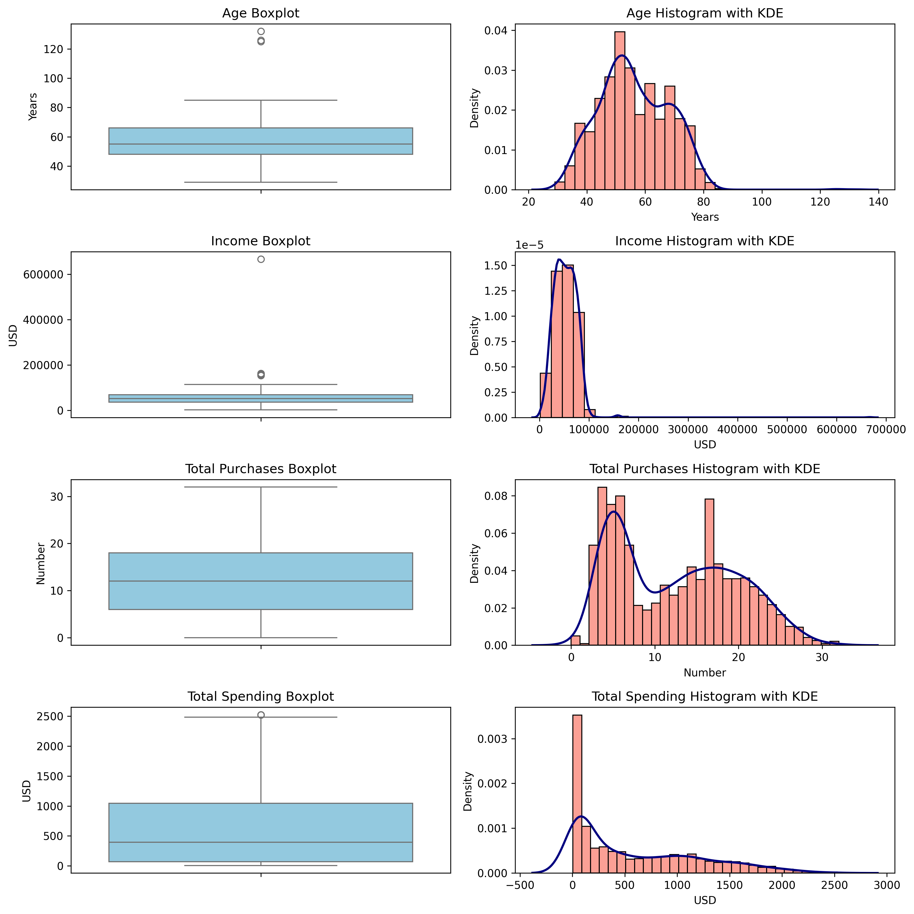
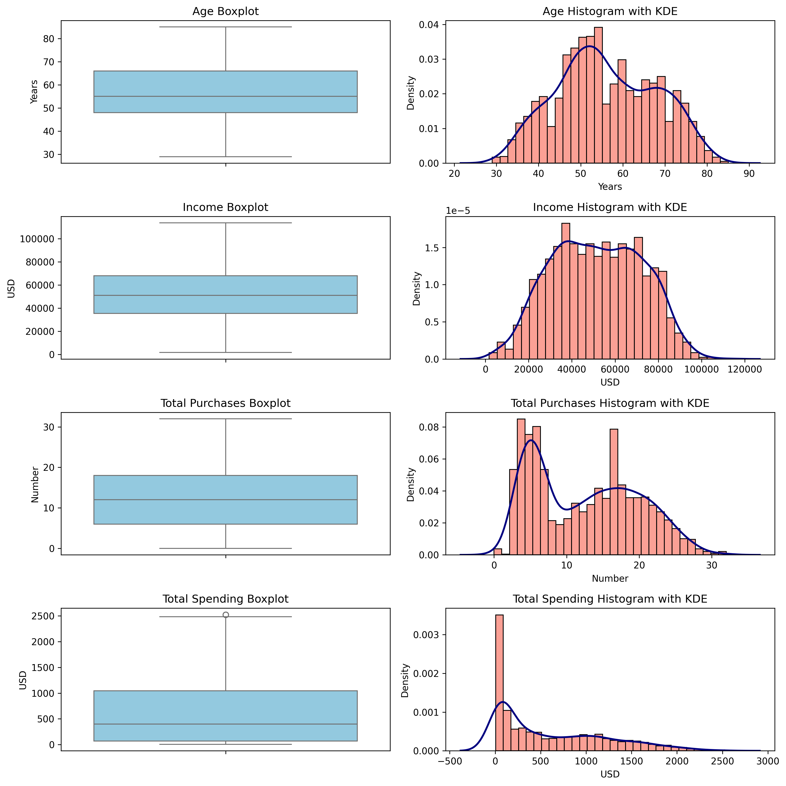
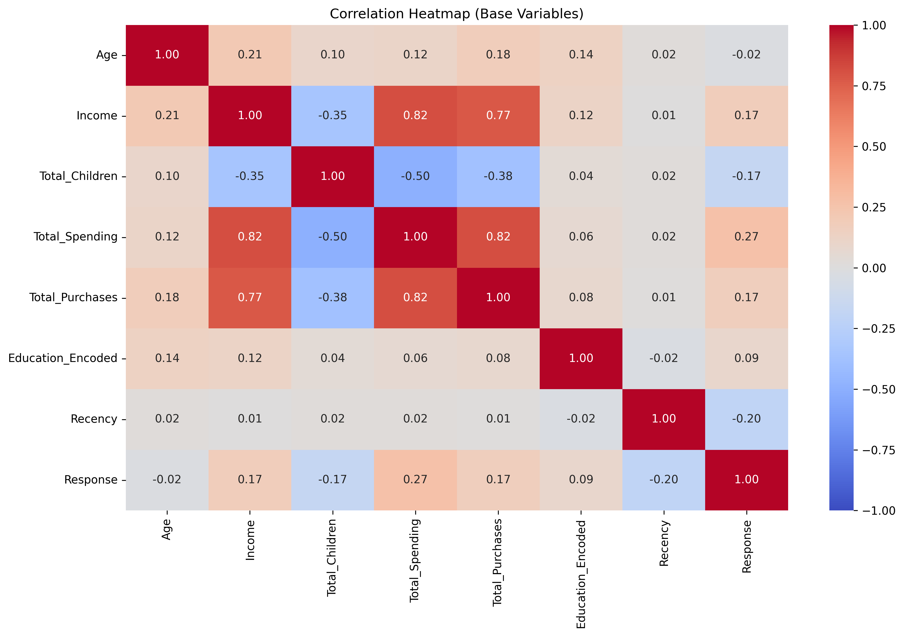
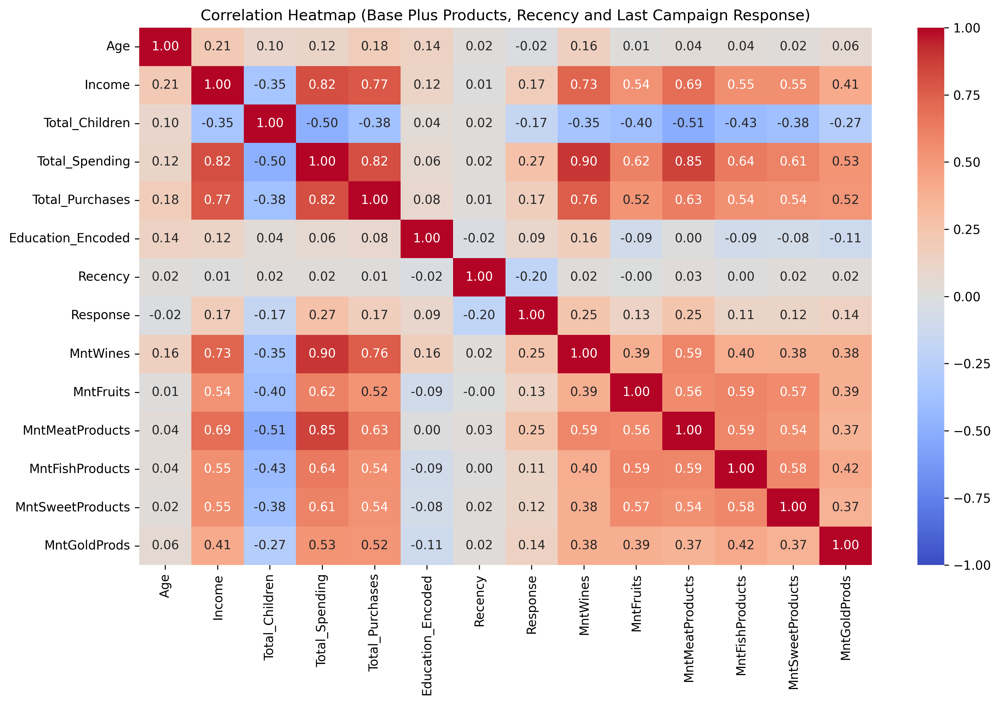
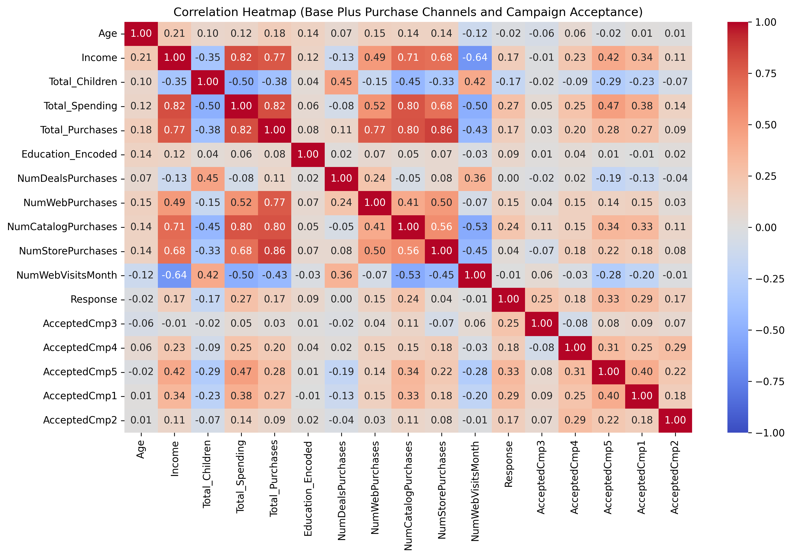
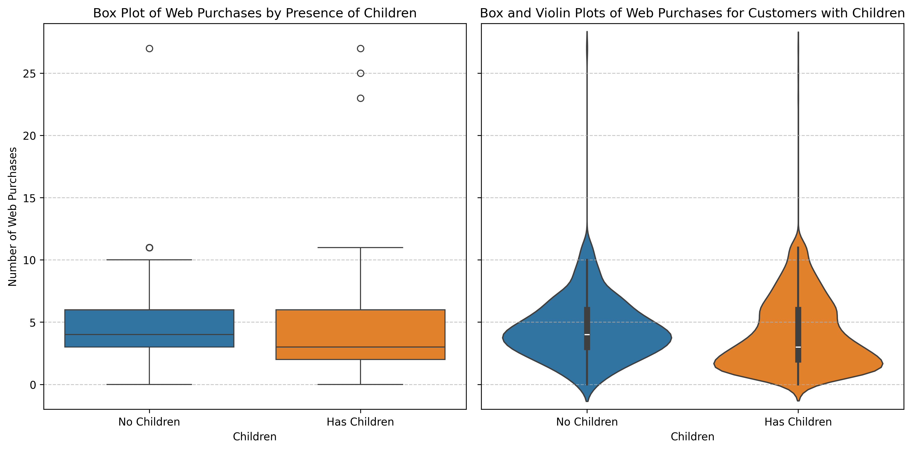
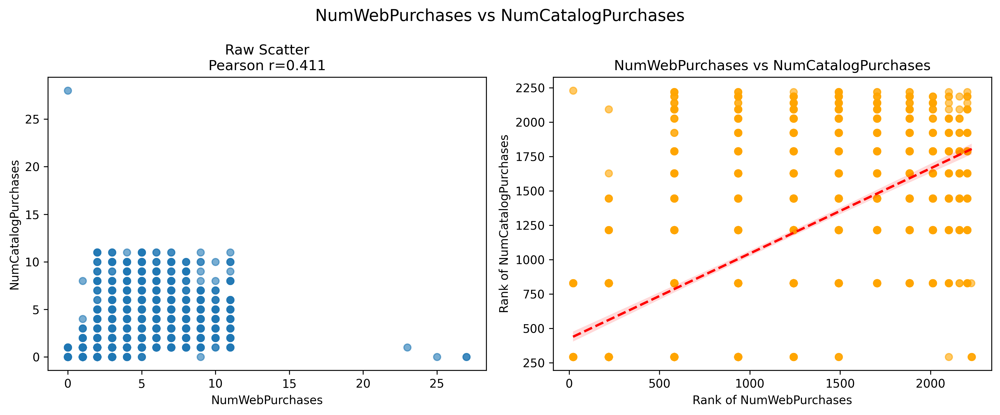
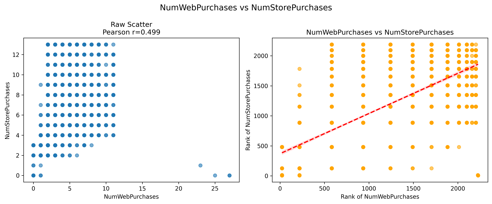
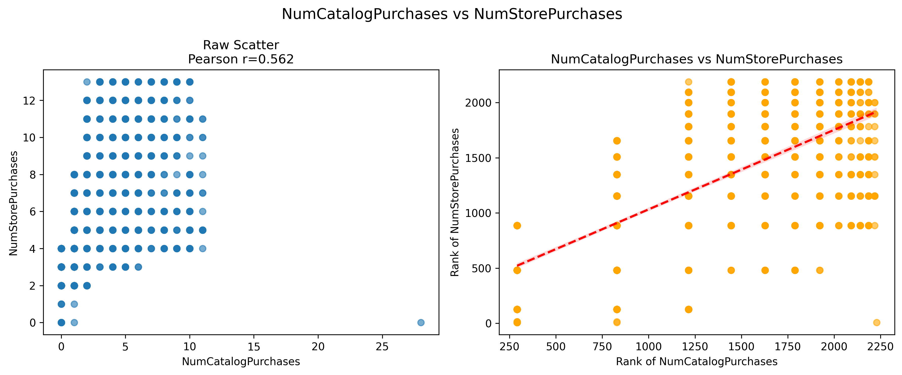
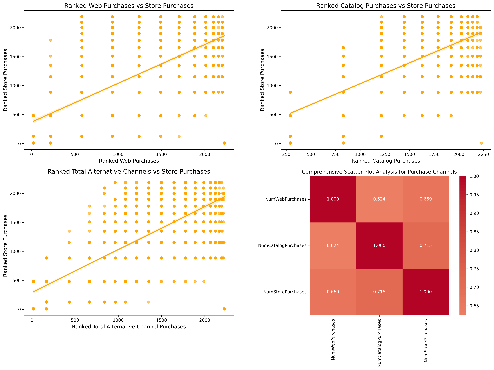

# Marketing Campaign Analysis

- [Marketing Campaign Analysis](#marketing-campaign-analysis)
  - [Marketing Campaign Analysis - Exploratory Data Analysis, Hypothesis Testing and Additional Visualizations](#marketing-campaign-analysis---exploratory-data-analysis-hypothesis-testing-and-additional-visualizations)
    - [Summary Notebooks](#summary-notebooks)
    - [Working Notebooks](#working-notebooks)
  - [Step 0: Load and Investigate the Data](#step-0-load-and-investigate-the-data)
  - [Step 1: Examine Dt\_Customer and Income](#step-1-examine-dt_customer-and-income)
  - [Step 2: Missing Value Imputation](#step-2-missing-value-imputation)
    - [Data Cleaning](#data-cleaning)
      - [Here’s how cleansing the Education values was undertaken](#heres-how-cleansing-the-education-values-was-undertaken)
      - [Original Education values](#original-education-values)
      - [Cleaned Education values](#cleaned-education-values)
      - [The cleaning process used for merging non-standard categories in the Marital Status column](#the-cleaning-process-used-for-merging-non-standard-categories-in-the-marital-status-column)
      - [Original Marital Status values](#original-marital-status-values)
      - [Cleaned Marital\_Status values](#cleaned-marital_status-values)
      - [Calculate mean and median income by Marital Status and Education](#calculate-mean-and-median-income-by-marital-status-and-education)
        - [Mean Income Pivot Table](#mean-income-pivot-table)
        - [Median Income Pivot Table:](#median-income-pivot-table)
    - [Missing Value Imputation](#missing-value-imputation)
      - [Basic Statistical Data for Income column](#basic-statistical-data-for-income-column)
      - [Basic Statistical Data for Income column after imputation](#basic-statistical-data-for-income-column-after-imputation)
      - [Median Income Pivot Table After Imputation](#median-income-pivot-table-after-imputation)
  - [Step 3: Feature Engineering](#step-3-feature-engineering)
    - [Create new features for Age, Total Children, Total Spending, and Total Purchases](#create-new-features-for-age-total-children-total-spending-and-total-purchases)
  - [Step 4: Visualizations](#step-4-visualizations)
    - [Original Plots for Age, Income, Total Purchases, Total Spending](#original-plots-for-age-income-total-purchases-total-spending)
    - [Outlier Calculations and Data Modification](#outlier-calculations-and-data-modification)
      - [Age](#age)
      - [Income](#income)
      - [Total\_Purchases](#total_purchases)
      - [Total\_Spending](#total_spending)
    - [Median Income Pivot Table After Imputation Step](#median-income-pivot-table-after-imputation-step)
    - [Median Income Pivot Table After Removing Outliers](#median-income-pivot-table-after-removing-outliers)
    - [Updated Plots for Age, Income, Total Purchases, Total Spending after Removing Outliers](#updated-plots-for-age-income-total-purchases-total-spending-after-removing-outliers)
    - [Conclusion](#conclusion)
  - [Step 5: Encoding Categorical Variables](#step-5-encoding-categorical-variables)
    - [Ordinal encoding for Education](#ordinal-encoding-for-education)
    - [One-hot encoding for Marital\_Status and Country](#one-hot-encoding-for-marital_status-and-country)
  - [Step 6: Correlation Heatmaps](#step-6-correlation-heatmaps)
    - [Base Correlation Heatmap](#base-correlation-heatmap)
    - [Correlation Heatmap (Base Plus Products, Recency and Last Campaign Response)](#correlation-heatmap-base-plus-products-recency-and-last-campaign-response)
    - [Correlation Heatmap (Base Plus Purchase Channels and Campaign Acceptance)](#correlation-heatmap-base-plus-purchase-channels-and-campaign-acceptance)
    - [Results](#results)
      - [Strong Positive Correlations (0.7+)](#strong-positive-correlations-07)
      - [Moderate Correlations (0.4-0.7)](#moderate-correlations-04-07)
      - [Notable Negative Correlations](#notable-negative-correlations)
      - [Weaker Relationships](#weaker-relationships)
  - [Step 7: Hypothesis Testing](#step-7-hypothesis-testing)
  - [a. Older individuals prefer in-store shopping](#a-older-individuals-prefer-in-store-shopping)
    - [Hypothesis Test](#hypothesis-test)
      - [Specify H₀ and H₁](#specify-h-and-h)
      - [Normality and Test Choice](#normality-and-test-choice)
      - [Interpreting Results](#interpreting-results)
    - [Results](#results-1)
      - [Normality Tests](#normality-tests)
        - [Perform Shapiro-Wilk Test](#perform-shapiro-wilk-test)
        - [Descriptive Statistics](#descriptive-statistics)
        - [Visualizations](#visualizations)
      - [Non-Parametric Test](#non-parametric-test)
        - [Mann-Whitney U Test (One-Tailed) Results](#mann-whitney-u-test-one-tailed-results)
      - [Parametric Tests](#parametric-tests)
        - [Why a t-test may be ok](#why-a-t-test-may-be-ok)
        - [Perform Levene's test](#perform-levenes-test)
        - [Modified Levene’s Test (Brown-Forsythe) Results](#modified-levenes-test-brown-forsythe-results)
        - [Welch's t-Test (unequal variances):](#welchs-t-test-unequal-variances)
    - [Conclusions](#conclusions)
  - [b. Customers with children prefer online shopping](#b-customers-with-children-prefer-online-shopping)
    - [Hypothesis Test](#hypothesis-test-1)
      - [Specify H₀ and H₁](#specify-h-and-h-1)
      - [Normality and Test Choice](#normality-and-test-choice-1)
      - [Interpreting Results](#interpreting-results-1)
    - [Results](#results-2)
      - [Normality Tests](#normality-tests-1)
        - [Perform Shapiro-Wilk Test](#perform-shapiro-wilk-test-1)
        - [Descriptive Statistics](#descriptive-statistics-1)
        - [Visualizations](#visualizations-1)
      - [Non-Parametric Tests](#non-parametric-tests)
        - [Mann-Whitney U Test (One-Tailed) Results](#mann-whitney-u-test-one-tailed-results-1)
      - [Parametric Tests](#parametric-tests-1)
        - [Why a t-test may be ok](#why-a-t-test-may-be-ok-1)
        - [Perform Levene's test](#perform-levenes-test-1)
        - [Modified Levene’s Test (Brown-Forsythe) Results](#modified-levenes-test-brown-forsythe-results-1)
        - [Welch's t-Test (unequal variances)](#welchs-t-test-unequal-variances-1)
    - [Conclusions](#conclusions-1)
  - [c. Store Sales Cannibalization by alternative distribution channels](#c-store-sales-cannibalization-by-alternative-distribution-channels)
    - [Hypothesis Test](#hypothesis-test-2)
      - [Specify H₀ and H₁](#specify-h-and-h-2)
      - [Normality and Test Choice](#normality-and-test-choice-2)
      - [Correlation Test Choices](#correlation-test-choices)
      - [Interpreting Results](#interpreting-results-2)
    - [Results](#results-3)
      - [Normality Tests](#normality-tests-2)
        - [Perform Shapiro-Wilk Test](#perform-shapiro-wilk-test-2)
        - [Descriptive Statistics](#descriptive-statistics-2)
        - [Distribution Channel Analysis](#distribution-channel-analysis)
      - [Correlation Analysis](#correlation-analysis)
        - [Comprehensive Scatter Plot Analysis for Correlation](#comprehensive-scatter-plot-analysis-for-correlation)
        - [Correlation Conclusion](#correlation-conclusion)
      - [Non-Parametric Tests](#non-parametric-tests-1)
        - [Hypothesis Testing Based on User Behavior - High/Low](#hypothesis-testing-based-on-user-behavior---highlow)
        - [Median Results](#median-results)
        - [Complete cannibalization analysis with multiple comparison correction](#complete-cannibalization-analysis-with-multiple-comparison-correction)
    - [Conclusions](#conclusions-2)
      - [What do the results mean?](#what-do-the-results-mean)
        - [Multiple Comparison Results](#multiple-comparison-results)
        - [What Can Be Concluded](#what-can-be-concluded)
        - [Final Interpretation](#final-interpretation)
  - [d. US versus the rest of the world in total purchases per customer](#d-us-versus-the-rest-of-the-world-in-total-purchases-per-customer)
    - [Hypothesis Test](#hypothesis-test-3)
      - [Specify H₀ and H₁](#specify-h-and-h-3)
      - [Normality and Test Choice](#normality-and-test-choice-3)
      - [Interpreting Results](#interpreting-results-3)
    - [Results](#results-4)
      - [Normality Tests](#normality-tests-3)
        - [Perform Shapiro-Wilk Test](#perform-shapiro-wilk-test-3)
        - [Descriptive Statistics](#descriptive-statistics-3)
        - [Visualizations](#visualizations-2)
      - [Non-Parametric Tests](#non-parametric-tests-2)
        - [Mann-Whitney U Test](#mann-whitney-u-test)
      - [Parametric Tests](#parametric-tests-2)
        - [Why a t-test may be ok](#why-a-t-test-may-be-ok-2)
        - [Perform Levene's test](#perform-levenes-test-2)
        - [Modified Levene’s Test (Brown-Forsythe) Results](#modified-levenes-test-brown-forsythe-results-2)
        - [Standard t-Test (equal variances)](#standard-t-test-equal-variances)
    - [Conclusions](#conclusions-3)
  - [Step 8: Additional Visualizations](#step-8-additional-visualizations)
  - [a. Identify the top-performing products and those with the lowest revenue.](#a-identify-the-top-performing-products-and-those-with-the-lowest-revenue)
    - [Results Visualization](#results-visualization)
    - [Key Findings](#key-findings)
  - [b. Examine if there is a correlation between customers’ age and the acceptance rate of the last campaign](#b-examine-if-there-is-a-correlation-between-customers-age-and-the-acceptance-rate-of-the-last-campaign)
    - [Age Grouping and Acceptance Data for Age Groups](#age-grouping-and-acceptance-data-for-age-groups)
      - [Raw Data](#raw-data)
      - [Output](#output)
    - [Results Visualization](#results-visualization-1)
    - [Key Findings](#key-findings-1)
    - [Statistical Considerations](#statistical-considerations)
    - [Result](#result)
  - [c. Determine the country with the highest number of customers who accepted the last campaign.](#c-determine-the-country-with-the-highest-number-of-customers-who-accepted-the-last-campaign)
    - [Data Set Overview](#data-set-overview)
    - [Results Visualization](#results-visualization-2)
      - [Detailed Insights](#detailed-insights)
    - [Key Findings](#key-findings-2)
  - [d. Investigate if there is a discernible pattern in the number of children at home and the total expenditure.](#d-investigate-if-there-is-a-discernible-pattern-in-the-number-of-children-at-home-and-the-total-expenditure)
    - [Children at Home vs. Total Expenditure Analysis](#children-at-home-vs-total-expenditure-analysis)
      - [Raw Data](#raw-data-1)
    - [Key Findings](#key-findings-3)
      - [Summary Results](#summary-results)
    - [Results Visualization](#results-visualization-3)
      - [Expenditure](#expenditure)
      - [Implications](#implications)
      - [Conclusion](#conclusion-1)
  - [e. Analyze the educational background of customers who lodged complaints in the last two years.](#e-analyze-the-educational-background-of-customers-who-lodged-complaints-in-the-last-two-years)
    - [Results Visualization](#results-visualization-4)
    - [Key Findings](#key-findings-4)


## Marketing Campaign Analysis - Exploratory Data Analysis, Hypothesis Testing and Additional Visualizations

The complete set of notebooks performs exploratory data analysis and hypothesis testing on marketing campaign data to understand customer acquisition factors. The summarized results for EDA are presented below. The hypothesis testing and additional visualizations are in separate notebooks. Together, these 3 notebooks provide the results of comprehensive analysis of the marketing campaign data.

### Summary Notebooks

1. 01_marketing_campaign_analysis.ipynb - Exploratory Data Analysis
2. 09_step_7_hypothesis_testing.ipynb - Hypothesis Testing
3. 14_step_8_additional_visualizations.ipynb - Additional Visualizations

### Working Notebooks

Please refer to the individual notebooks for detailed analysis, code, and visualizations.

- EDA Notebooks:
  - 02_step_0_load_and_investigate_the_data.ipynb
  - 03_step_1_examine_dt_customer_and_income.ipynb
  - 04_step_2_missing_value_imputation.ipynb
  - 05_step_3_feature_engineering.ipynb
  - 06_step_4_visualizations_box_plots_histograms_and_den.ipynb
  - 07_step_5_encoding_categorical_variables.ipynb
  - 08_step_6_correlation_heatmap.ipynb
- Hypothesis Testing Notebooks:
  - 10_older_individuals_prefer_in_store_shopping.ipynb
  - 11_customers_with_children_prefer_online_shopping.ipynb
  - 12_store_sales_cannibalization_by_alternative_distrib.ipynb
  - 13_us_versus_the_rest_of_the_world_in_total_purchases.ipynb
- Additional Visualizations Notebooks:
  - 15_identify_the_top_performing_products_and_those_wit.ipynb
  - 16_examine_if_there_is_a_correlation_between_customer.ipynb
  - 17_determine_the_country_with_the_highest_number_of_c.ipynb
  - 18_investigate_if_there_is_a_discernible_pattern_in_t.ipynb
  - 19_analyze_the_educational_background_of_customers_wh.ipynb

## Step 0: Load and Investigate the Data

- Load the data
- Fix the Income column name to remove the spaces in the column name

**Data columns (total 28 columns):**

|#   |Column              |Non-Null Count |Dtype|
|----|--------------------|---------------|-----|
|0   |ID                  |2240 non-null  |int64|
|1   |Year_Birth          |2240 non-null  |int64|
|2   |Education           |2240 non-null  |object|
|3   |Marital_Status      |2240 non-null  |object|
|4   |Income              |2216 non-null  |object|
|5   |Kidhome             |2240 non-null  |int64|
|6   |Teenhome            |2240 non-null  |int64|
|7   |Dt_Customer         |2240 non-null  |object|
|8   |Recency             |2240 non-null  |int64|
|9   |MntWines            |2240 non-null  |int64|
|10  |MntFruits           |2240 non-null  |int64|
|11  |MntMeatProducts     |2240 non-null  |int64|
|12  |MntFishProducts     |2240 non-null  |int64|
|13  |MntSweetProducts    |2240 non-null  |int64|
|14  |MntGoldProds        |2240 non-null  |int64|
|15  |NumDealsPurchases   |2240 non-null  |int64|
|16  |NumWebPurchases     |2240 non-null  |int64|
|17  |NumCatalogPurchases |2240 non-null  |int64|
|18  |NumStorePurchases   |2240 non-null  |int64|
|19  |NumWebVisitsMonth   |2240 non-null  |int64|
|20  |AcceptedCmp3        |2240 non-null  |int64|
|21  |AcceptedCmp4        |2240 non-null  |int64|
|22  |AcceptedCmp5        |2240 non-null  |int64|
|23  |AcceptedCmp1        |2240 non-null  |int64|
|24  |AcceptedCmp2        |2240 non-null  |int64|
|25  |Response            |2240 non-null  |int64|
|26  |Complain            |2240 non-null  |int64|
|27  |Country             |2240 non-null  |object|

---

## Step 1: Examine Dt_Customer and Income

- Converting Dt_Customer to datetime
- Cleaning Income Column

## Step 2: Missing Value Imputation

### Data Cleaning

The instructions emphasize cleaning the Education and Marital Status categories and use those categories for Income Value Imputation.

#### Here’s how cleansing the Education values was undertaken

- The presence of 2n Cycle alongside Master suggests potential redundancy, as both likely refer to postgraduate education. Basic is vague and may need clarification or standardization.
  - Merge 2n Cycle with Master: Since 2n Cycle corresponds to a Master’s degree in the Bologna Process, combining it with Master standardizes the category to a more universally recognized term.
- Clarify Basic: Without additional context, Basic likely represents education below a Bachelor’s degree
  - (e.g., high school or less). It will be renamed to something clearer: "Secondary"
- Retain Graduation and rename to Bachelor

#### Original Education values

|Value         |Count|
|--------------|-----|
|Graduation    |1127|
|PhD            |486|
|Master         |370|
|2n Cycle       |203|
|Basic           |54|

#### Cleaned Education values

|Value         |Count|
|--------------|-----|
|Bachelor     |1127|
|Master        |573|
|PhD           |486|
|Secondary      |54|

#### The cleaning process used for merging non-standard categories in the Marital Status column

- Merge (YOLO, Alone, Absurd) into a standard one (Single), reducing redundancy:
  - YOLO (2 entries): Likely a joke or informal entry implying a single. Merging into Single.
  - Alone (3 entries): Implies no partner, aligning with Single. Merging into Single.
  - Absurd (2 entries): Ambiguous, but with such low frequency, it’s likely an error or non-standard
- Retain Married, Together, Divorced, and Widow as distinct categories, as they reflect standard marital statuses.
  - Married: 864 (standard, refers to legally married individuals)
  - Together: 580 (likely refers to cohabiting partners, not legally married)
  - Divorced: 232 (standard, refers to legally divorced individuals)
  - Widow: 77 (standard, refers to individuals whose spouse has passed away)

#### Original Marital Status values

|Value      |Count|
|-----------|-----|
|Married    | 864|
|Together   | 580|
|Single     | 480|
|Divorced   | 232|
|Widow      | 77|
|Alone      | 3|
|YOLO       | 2|
|Absurd     | 2|

#### Cleaned Marital_Status values

|Value       |Count|
|------------|-----|
|Married     | 864|
|Together    | 580|
|Single      | 487|
|Divorced    | 232|
|Widow      | 77|

#### Calculate mean and median income by Marital Status and Education

##### Mean Income Pivot Table

|Marital_Status |Bachelor    |Master       |PhD         |Secondary   |
|----------------|------------|-------------|------------|------------|
|Divorced        |54526.04   |49972.83    |53096.62   |9548.00    |
|Married         |50800.26   |50686.06    |58138.03   |21960.50   |
|Single          |51365.63   |53751.08    |53039.67   |18238.67   |
|Together        |55758.48   |49495.94    |56041.42   |21240.07   |
|Widow           |54976.66   |56211.12    |60288.08   |22123.00   |

##### Median Income Pivot Table:

| Marital_Status       | Bachelor   | Master      | PhD       | Secondary  |
|-----------------|------------|-------------|-----------|------------|
| Divorced        | 55635.00   | 49297.00    | 50613.50  | 9548.00    |
| Married         | 50737.00   | 50017.00    | 57081.50  | 22352.00   |
| Single          | 49973.50   | 49514.00    | 48918.00  | 16383.00   |
| Together       | 53977.00   | 47586.50    | 56756.00  | 23179.00   |
| Widow          | 58275.00   | 51459.50    | 57032.00  | 22123.00   |

### Missing Value Imputation

#### Basic Statistical Data for Income column

|Statistic | Value      |
|----------|-----------|
|count      |2216.00|
|mean      |52247.25|
|std       |25173.08|
|min        |1730.00|
|25%       |35303.00|
|50%       |51381.50|
|75%       |68522.00|
|max       |666666.00|
|skew      | 6.76      |
|NaN count | 24        |

The skewness value of 6.76 indicates extremely high positive skewness in income distribution

- Mean income will be substantially higher than median income
- Standard deviation may not accurately represent typical variation
- The bulk of data points cluster at lower income levels
- Use median instead of mean as a measure of central tendency

**Conclusion**: Impute missing Income values using the median income for the appropriate Education and Maritial_Status categories

#### Basic Statistical Data for Income column after imputation

| Statistic | Value      |
|-----------|------------|
| count     | 2240.00    |
| mean      | 52229.62   |
| std       | 25040.06   |
| min       | 1730.00    |
| 25%       | 35538.75   |
| 50%       | 51222.50   |
| 75%       | 68289.75   |
| max       | 666666.00  |

Notice the count value has increased from 2216 to 2240 which has also altered the _overall_ mean and median

#### Median Income Pivot Table After Imputation

|Marital_Status  |Bachelor   |Master      |PhD        |Secondary  |
|----------------|-----------|------------|-----------|-----------|
|Divorced        |55635.00   |49297.00    |50613.50   |9548.00    |
|Married         |50737.00   |50017.00    |57081.50   |22352.00   |
|Single          |49973.50   |49514.00    |48918.00   |16383.00   |
|Together        |53977.00   |47586.50    |56756.00   |23179.00   |
|Widow           |58275.00   |51459.50    |57032.00   |22123.00   |

The categorical median has been retained as seen in the updated pivot table

## Step 3: Feature Engineering

### Create new features for Age, Total Children, Total Spending, and Total Purchases

```python
# current_year = 2025
# df['Age'] = current_year - df['Year_Birth']
# df['Total_Children'] = df['Kidhome'] + df['Teenhome']
# df['Total_Spending'] = df[['MntWines', 'MntFruits', 'MntMeatProducts',
#                          'MntFishProducts', 'MntSweetProducts',
#                          'MntGoldProds']].sum(axis=1)
#df['Total_Purchases'] = df[['NumWebPurchases', 'NumCatalogPurchases',
#                            'NumStorePurchases']].sum(axis=1)
```

## Step 4: Visualizations

### Original Plots for Age, Income, Total Purchases, Total Spending



### Outlier Calculations and Data Modification

**Formula for identifying outliers using the IQR method:**

``` python
Q1 = df[column].quantile(0.25)
Q3 = df[column].quantile(0.75)
IQR = Q3 - Q1
lower_bound = Q1 - 1.5 * IQR
upper_bound = Q3 + 1.5 * IQR
```

#### Age

Lower Bound: 21.0

- Number of records below Lower Bound: 0
- Number of records less than 0: 0

Upper Bound: 93.0

- Number of records above Upper Bound: 3
  - 132
  - 126
  - 125

#### Income

Lower Bound: -$13587.75

- Number of records below Lower Bound: 0
- Number of records less than 0: 0

Upper Bound: $117416.25

- Number of records above Upper Bound: 8
  - $157146.00
  - $160803.00
  - $666666.00
  - $162397.00
  - $157733.00
  - $153924.00
  - $156924.00
  - $157243.00

#### Total_Purchases

Lower Bound: -12

- Number of records below Lower Bound: 0
- Number of records less than 0: 0

Upper Bound: 36

- Number of records above Upper Bound: 0

#### Total_Spending

Lower Bound: -$1396.38

- Number of records below Lower Bound: 0
- Number of records less than 0: 0

Upper Bound: $2510.63

- Number of records above Upper Bound: 3
  - $2525.00
  - $2525.00
  - $2524.00

Results from the plots and outlier calculations show that for the variables Total_Purchases and Total_Spending it does not make sense to remove any outliers. While the data is skewed the outlier data is relevant.

For the variables Age and Income different results are shown.

- For Age the 3 outlier values seem to be erroneous since the ages are above 93.
  - The suggestion is to remove these rows.
- For Income 1 of the 8 values seems to be erroneous or at least drastically different than the rest of the data.
  - The suggestion is to remove the rows with Income outliers above the upper bound

### Median Income Pivot Table After Imputation Step

|Marital_Status  |Bachelor   |Master      |PhD        |Secondary  |
|----------------|-----------|------------|-----------|-----------|
|Divorced        |55635.00   |49297.00    |50613.50   |9548.00    |
|Married         |50737.00   |50017.00    |57081.50   |22352.00   |
|Single          |49973.50   |49514.00    |48918.00   |16383.00   |
|Together        |53977.00   |47586.50    |56756.00   |23179.00   |
|Widow           |58275.00   |51459.50    |57032.00   |22123.00   |

### Median Income Pivot Table After Removing Outliers

|Marital_Status  |Bachelor   |Master      |PhD        |Secondary  |
|----------------|-----------|------------|-----------|-----------|
|Divorced        |55599.00   |49476.00    |50613.50   |9548.00    |
|Married         |50737.00   |50017.00    |57072.00   |22352.00   |
|Single          |49973.50   |49514.00    |48918.00   |16383.00   |
|Together        |53977.00   |47586.50    |56575.00   |23179.00   |
|Widow           |58275.00   |51459.50    |57032.00   |22123.00   |

The categorical median has been retained after removing the outliers except for the Divorced-Bachelors category where it has gone from 55635.00 to 55599.00 as seen in the updated pivot table.

### Updated Plots for Age, Income, Total Purchases, Total Spending after Removing Outliers



### Conclusion

After removing outliers from Age and Income the box and histogram plots look more like a normal curve. However Total Purchases and Total Spending are still very heavily right skewed.

## Step 5: Encoding Categorical Variables

### Ordinal encoding for Education

``` python
education_mapping = {'Secondary': 1, 'Bachelor': 2, 'Master': 3, 'PhD': 4}
df['Education_Encoded'] = df['Education'].map(education_mapping)
df.drop(columns=['Education'],inplace=True)
```

### One-hot encoding for Marital_Status and Country

``` python
df = pd.get_dummies(df, columns=['Marital_Status', 'Country'], prefix=['Marital', 'Country'])

Index(['ID', 'Year_Birth', 'Income', 'Kidhome', 'Teenhome', 'Dt_Customer',
       'Recency', 'MntWines', 'MntFruits', 'MntMeatProducts',
       'MntFishProducts', 'MntSweetProducts', 'MntGoldProds',
       'NumDealsPurchases', 'NumWebPurchases', 'NumCatalogPurchases',
       'NumStorePurchases', 'NumWebVisitsMonth', 'AcceptedCmp3',
       'AcceptedCmp4', 'AcceptedCmp5', 'AcceptedCmp1', 'AcceptedCmp2',
       'Response', 'Complain', 'Age', 'Total_Children', 'Total_Spending',
       'Total_Purchases', 'Education_Encoded', 'Marital_Divorced',
       'Marital_Married', 'Marital_Single', 'Marital_Together',
       'Marital_Widow', 'Country_AUS', 'Country_CA', 'Country_GER',
       'Country_IND', 'Country_ME', 'Country_SA', 'Country_SP', 'Country_US'],
      dtype='object')
```

## Step 6: Correlation Heatmaps

### Base Correlation Heatmap



### Correlation Heatmap (Base Plus Products, Recency and Last Campaign Response)



### Correlation Heatmap (Base Plus Purchase Channels and Campaign Acceptance)



### Results

#### Strong Positive Correlations (0.7+)

- Income-Spending Cluster: The strongest relationships center around income and spending patterns:
  - Income ↔ Total_Spending (0.82): Higher income directly drives higher overall
  - Income ↔ Total_Purchases (0.77): Wealthier customers make more transactions
  - Total_Spending ↔ Total_Purchases (0.82): More spending correlates with more purchase events
- Product Category Interconnections: Customers who buy one premium product category tend to buy others:
  - MntWines ↔ Total_Spending (0.90): Wine purchases are the strongest predictor of total spending
  - MntMeatProducts ↔ Total_Spending (0.85): Meat products also strongly correlate with overall spending
  - Various product categories show moderate correlations (0.4-0.6), suggesting cross-category purchasing

#### Moderate Correlations (0.4-0.7)

- Purchase Channel Patterns:
  - NumCatalogPurchases ↔ Income (0.71): Higher-income customers prefer catalog shopping
  - NumWebPurchases ↔ Income (0.49): Web purchases also increase with income
  - NumStorePurchases ↔ Income (0.68): Store visits correlate with income

#### Notable Negative Correlations

- Family Structure Impact:
  - Total_Children ↔ Income (-0.35): More children correlates with lower income
  - Total_Children ↔ Total_Spending (-0.50): Families with more children spend less overall
  - NumWebVisitsMonth shows negative correlations with spending (-0.50) and purchases (-0.43):
    More web browsing without purchasing suggests price sensitivity

#### Weaker Relationships

- Campaign Response: Most campaign acceptance rates show weak correlations (0.1-0.4) with other variables, suggesting campaigns aren’t strongly tied to demographic or spending patterns.
- Recency: Shows very weak correlations across the board, indicating recent purchase timing isn’t strongly predictive of other behaviors.

---
---

## Step 7: Hypothesis Testing

This section contains hypothesis testing results for the Marketing Campaign Analysis project. It encompasses the summary of key findings and insights derived from the data analysis. The actual python code used to perform the hypothesis testing can be found in the corresponding Jupyter notebooks.

- 10_older_individuals_prefer_in_store_shopping.ipynb
- 11_customers_with_children_prefer_online_shopping.ipynb
- 12_store_sales_cannibalization_by_alternative_distrib.ipynb
- 13_us_versus_the_rest_of_the_world_in_total_purchases.ipynb

## a. Older individuals prefer in-store shopping

### Hypothesis Test

#### Specify H₀ and H₁

- H₀: The distributions of NumStorePurchases for older and younger customers are identical (no difference in distribution).
- H₁: The distributions of NumStorePurchases for older customers is stochastically greater (they tend to have higher values).

#### Normality and Test Choice

- Use the t-test if NumStorePurchases is approximately normally distributed.
- Use the Mann-Whitney U test if the data is non-normal.

#### Interpreting Results

- P-value ≤ α (0.05): Reject H₀, concluding there is evidence that older customers have higher in-store purchases.
- P-value > α: Fail to reject H₀, indicating insufficient evidence that older customers prefer in-store purchases.

### Results

#### Normality Tests

##### Perform Shapiro-Wilk Test

_Purpose:_

- Tests the null hypothesis (H₀) that the data from the groups is normally distributed.
- Alternative hypothesis (H₁): The data is not normally distributed.

_Shapiro-Wilk Test Results:_

- Shapiro-Wilk Test for Older Individuals = 1: p-value = 0.0000
  - p-value < 0.05: Reject H₀, data is not normally distributed.
- Shapiro-Wilk Test for Older Individuals = 0: p-value = 0.0000
  - p-value < 0.05: Reject H₀, data is not normally distributed.

##### Descriptive Statistics

| Older | mean  | median       | std  | count |
|-------|-------|--------------|------|-------|
| False | 5.359259 | 4.0          | 3.200239 | 1080 |
| True  | 6.238468 | 5.0          | 3.224830 | 1149 |

##### Visualizations


**Conclusion**: Shapiro-Wilk test and plots show data is not normally distributed so a non-parametric test seems more appropriate

---

#### Non-Parametric Test

##### Mann-Whitney U Test (One-Tailed) Results

- Mann-Whitney U Test: statistic = 735103.5000, p-value = 0.0000
  - Reject H₀: Older customers have higher in-store purchases

---

#### Parametric Tests

Parametric tests (e.g., t-tests) assume normality and homogeneity of variances.

##### Why a t-test may be ok

- Large sample sizes (e.g., n > 30 or ideally n > 50 per group), due to the Central Limit Theorem (CLT).
- The CLT states that the sampling distribution of the mean approaches normality as sample size increases, even if the underlying data is non-normal.

_Sample size for Older Customers:_

| Older | Sample Size |
|-------|-------------|
| True  | 1149        |
| False | 1080        |

##### Perform Levene's test

_Purpose:_

- Tests the null hypothesis (H₀) that the variances of the groups are equal.
- Alternative hypothesis (H₁): The variances are not equal.

_Variations of test:_

- Standard Levene’s Test: Uses the group mean for calculating deviations.
- Modified Levene’s Test (Brown-Forsythe): Uses the group median instead of the mean, which is more robust to non-normal data.

_Implications of test:_

- If Levene’s test indicates unequal variances (p-value ≤ 0.05), use Welch’s t-test to compare means.
- If variances are equal, use the standard t-test.

##### Modified Levene’s Test (Brown-Forsythe) Results

- Levene's Test: statistic = 4.1209, p-value = 0.0000
  - Unequal variances (p < 0.05)
- Unequal variances use Welch’s t-test to compare means
  - Run parametric Welch's t-test

##### Welch's t-Test (unequal variances):

- Welch's t-test: statistic = 6.4582, p-value = 0.0000
  - Reject H₀: Older customers have higher in-store purchases

---

### Conclusions

Both the parametric test (Welch's t-Test) and the non-parametric test (Mann-Whitney U Test) reject H₀, meaning there is evidence that older customers make more in-store purchases than younger customers.

---
---

## b. Customers with children prefer online shopping

### Hypothesis Test

#### Specify H₀ and H₁

- H₀: The distributions of NumWebPurchases for customers with and without children are identical (no difference in distribution).
- H₁: The distribution of NumWebPurchases for customers with children is stochastically greater (they tend to have higher values).

#### Normality and Test Choice

- Use the t-test if NumWebPurchases is approximately normally distributed.
- Use the Mann-Whitney U test if the data is non-normal.

#### Interpreting Results

- P-value ≤ α (0.05): Reject H₀, concluding there is evidence that customers with children prefer online shopping.
- P-value > α: Fail to reject H₀, indicating insufficient evidence that customers with children prefer online shopping.

### Results

#### Normality Tests

##### Perform Shapiro-Wilk Test

_Purpose:_

- Tests the null hypothesis (H₀) that the data from the groups is normally distributed.
- Alternative hypothesis (H₁): The data is not normally distributed.

_Shapiro-Wilk Test Results:_

- Shapiro-Wilk Test for Has_Children = 1: p-value = 0.0000
  - p-value < 0.05: Reject H₀, data is not normally distributed.
- Shapiro-Wilk Test for Has_Children = 0: p-value = 0.0000
  - p-value < 0.05: Reject H₀, data is not normally distributed.

##### Descriptive Statistics

| Has Children |      mean |  median |       std | count |
|--------------|-----------|---------|-----------|-------|
| False        | 4.421801  | 4.0     | 2.468273  | 633   |
| True         | 3.972431  | 3.0     | 2.879044  | 1596  |

##### Visualizations



**Conclusion**: Shapiro-Wilk test and plots show data is not normally distributed so a non-parametric test seems more appropriate

---

#### Non-Parametric Tests

##### Mann-Whitney U Test (One-Tailed) Results

- Mann-Whitney U Test: statistic = 428511.0000, p-value = 1.0000
  - Fail to reject H₀: No evidence that customers with children have higher web purchases

---

#### Parametric Tests

Parametric tests (e.g., t-tests) assume normality and homogeneity of variances.

##### Why a t-test may be ok

- Large sample sizes (e.g., n > 30 or ideally n > 50 per group), due to the Central Limit Theorem (CLT).
- The CLT states that the sampling distribution of the mean approaches normality as sample size increases, even if the underlying data is non-normal.

_Sample size for Has Children:_

| Has Children | Sample Size |
|--------------|-------------|
| True         | 1596        |
| False        | 633         |

##### Perform Levene's test

_Purpose:_

- Alternative hypothesis (H₁): The variances are not equal.

_Variations of test:_

- Standard Levene’s Test: Uses the group mean for calculating deviations.
- Modified Levene’s Test (Brown-Forsythe): Uses the group median instead of the mean, which is more robust to non-normal data.

_Implications of test:_

- If Levene’s test indicates unequal variances (p-value ≤ 0.05), use Welch’s t-test to compare means.
- If variances are equal, use the standard t-test.

##### Modified Levene’s Test (Brown-Forsythe) Results

- Levene's Test: statistic = 22.7688, p-value = 0.0000
  - Unequal variances (p < 0.05)
- Unequal variances use Welch’s t-test to compare means
  - Run parametric Welch's t-test

##### Welch's t-Test (unequal variances)

- Welch's t-test: statistic = -3.6915, p-value = 0.9999
  - Fail to reject H₀: No evidence that customers with children have higher web purchases

---

### Conclusions

Both the parametric test (Welch's t-Test) and the non-parametric test (Mann-Whitney U Test) fail to reject H₀, meaning there is no evidence that customers with children have higher web purchases.

---
---

## c. Store Sales Cannibalization by alternative distribution channels

### Hypothesis Test

#### Specify H₀ and H₁

- Test if web/catalog purchases negatively correlate with store purchases
- Cannibalization requires store purchases to decrease when others increase
- H₀: High alternative channel users buy same/more in stores
- H₁: High alternative channel users buy LESS in stores (cannibalization)

#### Normality and Test Choice

- Use the t-test if the data from the 3 purchase groups is approximately normally distributed.
- Use the Mann-Whitney U test if the data is non-normal.

#### Correlation Test Choices

- Pearson:
  - Assumes linear relationships
  - Sensitive to outliers and skewness
  - Underestimates relationships in your data
- Spearman:
  - Works with monotonic relationships
  - Robust to outliers
  - Better captures the true strength of relationships in your skewed data

#### Interpreting Results

- The analysis ensures statistical validity through:
  - Multiple testing corrections when examining several channel pairs
  - Assumption checking for parametric tests
  - Robustness checks using non-parametric alternatives

### Results

#### Normality Tests

##### Perform Shapiro-Wilk Test

_Purpose:_

- Tests the null hypothesis (H₀) that the data from the groups is normally distributed.
- Alternative hypothesis (H₁): The data is not normally distributed.

_Shapiro-Wilk Test Results:_

- Shapiro-Wilk Test for NumStorePurchases: W= 0.9020, p-value = 0.0000
  - p-value < 0.05: Reject H₀, data is not normally distributed.
- Shapiro-Wilk Test for NumWebPurchases: W= 0.8970, p-value = 0.0000
  - p-value < 0.05: Reject H₀, data is not normally distributed.
- Shapiro-Wilk Test for NumCatalogPurchases: W= 0.8417, p-value = 0.0000
  - p-value < 0.05: Reject H₀, data is not normally distributed.

##### Descriptive Statistics

|Metric|NumStorePurchases  |NumWebPurchases   |NumCatalogPurchases   |Total_Purchases   |
|------|-------------------|------------------|----------------------|------------------|
|mean  |5.81               |4.10              |2.64                  |12.55             |
|std   |3.24               |2.78              |2.80                  |7.18              |
|min   |0.00               |0.00              |0.00                  |0.00              |
|25%   |3.00               |2.00              |0.00                  |6.00              |
|50%   |5.00               |4.00              |2.00                  |12.00             |
|75%   |8.00               |6.00              |4.00                  |18.00             |
|max   |13.00              |27.00             |28.00                 |32.00             |

##### Distribution Channel Analysis


**Conclusion**: Shapiro-Wilk test and plots show data is not normally distributed so a non-parametric test seems more appropriate

---

#### Correlation Analysis

**Detailed Correlation Analysis with Visualizations:**

NumWebPurchases vs NumCatalogPurchases:

- Pearson r=0.411, p=0.0000
- Spearman r=0.624, p=0.0000



NumWebPurchases vs NumStorePurchases:

- Pearson r=0.499, p=0.0000
- Spearman r=0.669, p=0.0000



NumCatalogPurchases vs NumStorePurchases:

- Pearson r=0.562, p=0.0000
- Spearman r=0.715, p=0.0000



_Spearman vs Pearson:_

Spearman is better for this analysis for several reasons:

1. Consistently Higher Values: Spearman correlations are substantially higher across all comparisons (0.62-0.72 vs 0.41-0.56), suggesting the relationships are stronger than Pearson indicates.
2. Non-linear Relationships: The raw scatter plots show clear evidence of non-linearity - clustered, stepped patterns rather than smooth linear trends. This is particularly evident in the catalog vs store plot.
3. Outliers and Skewness: The scatter plots reveal outliers and skewed distributions that can suppress Pearson correlations but don’t affect Spearman.
4. Count Data Characteristics: Purchase counts often follow non-normal distributions making rank-based correlation more appropriate.
The ranked scatter plots on the right show much cleaner, more linear relationships, confirming that Spearman better captures the true strength of association between these purchase behaviors.

##### Comprehensive Scatter Plot Analysis for Correlation



##### Correlation Conclusion

Correlation shows positive relationships between the various purchase methods

- Strongest Relationship:
  - Catalog and store purchases show the highest correlation (Pearson r=0.56, Spearman r=0.72), suggesting customers who buy from catalogs are also likely to shop in stores.

- Moderate Relationships:
  - Web and store purchases (Pearson r=0.50, Spearman r=0.67)
  - Web and catalog purchases (Pearson r=0.41, Spearman r=0.62)

---

#### Non-Parametric Tests

##### Hypothesis Testing Based on User Behavior - High/Low

_Test 1 (Web):_

- H₀: Distribution of store purchases is stochastically larger or equal for high web users
- H₁: Distribution of store purchases is stochastically smaller for high web users

_Test 2 (Catalog):_

- H₀: Distribution of store purchases is stochastically larger or equal for high catalog users
- H₁: Distribution of store purchases is stochastically smaller for high catalog users

```python
# High and Low Users
# high_web users equates to => df['NumWebPurchases'] > df['NumWebPurchases'].median()
# high_catalog users equates to => df['NumCatalogPurchases'] > df['NumCatalogPurchases'].median()
```

##### Median Results

_Web Cannibalization Test:_

- High web users - median store purchases: 7.0
- Low web users - median store purchases: 3.0

_Catalog Cannibalization Test:_

- High catalog users - median store purchases: 8.0
- Low catalog users - median store purchases: 3.0

##### Complete cannibalization analysis with multiple comparison correction

_What Each Column Represents:_

- Original_p: Raw p-values from Mann-Whitney tests (no correction)
- Bonferroni_p: Traditional Bonferroni correction (p × number_of_tests)
- Holm_p: Holm-Bonferroni correction (sequential method)
- FDR_p: False Discovery Rate correction (Benjamini-Hochberg)

_Why You're Comparing All Methods:_ Different Conservative Levels:

- Most Conservative: Traditional Bonferroni
- Moderate: Holm-Bonferroni
- Least Conservative: FDR (Benjamini-Hochberg)

_p Values_

|Test  |Original_p  |Bonferroni_p  |Holm_p  |FDR_p  |
|--------------------------|-----------------------|---------------------|--------------------|----------------|
|Web       |       1.0           |             1.0    |         1.0       | 1.0          |
|Catalog   |       1.0           |             1.0    |         1.0       | 1.0          |

_Reject Null Hypothesis - True/False_

|Test |Significant_Original  |Significant_Bonferroni | Significant_Holm  |Significant_FDR|
|--------------------------|-----------------------|---------------------|--------------------|----------------|
|Web       |       False           |             False    |         False       | False          |
|Catalog   |       False           |             False    |         False       | False          |

### Conclusions

#### What do the results mean?

- Significant = False means "Fail to reject the null hypothesis"
- Significant = True means "Reject the null hypothesis"
- p-value < 0.05 indicates statistical significance
- p-value can't be larger than 1.0

##### Multiple Comparison Results

- All adjustment methods (Bonferroni, Holm-Bonferroni, FDR) gave identical results, confirming that:
  - Robust conclusion - findings hold under different statistical assumptions
  - No need to worry about multiple testing - results are so clear that correction doesn’t matter

##### What Can Be Concluded

- Testing for cannibalization was performed using multiple statistical approaches with different levels of conservatism. Regardless of the correction method used (Bonferroni, Holm-Bonferroni, or FDR), no evidence of cannibalization (all p-values = 1.0), providing strong evidence that alternative channels complement rather than compete with store sales.

##### Final Interpretation

- There is no statistical evidence that web or catalog purchases cannibalize store sales. In fact, customers who purchase heavily through alternative channels also tend to be heavy store shoppers, suggesting these channels work synergistically rather than competitively.

---
---

## d. US versus the rest of the world in total purchases per customer

### Hypothesis Test

#### Specify H₀ and H₁

- H₀: The distributions of Total_Puchases for US and non-US customers are identical (no difference in distribution).
- H₁: The distribution of Total_Purchases for US customers is stochastically greater (US tends to have higher Total_Purchases for its customers).

#### Normality and Test Choice

- Use the t-test if Total_Puchases is approximately normally distributed.
- Use the Mann-Whitney U test if the data is non-normal.

#### Interpreting Results

- P-value ≤ α (0.05): Reject H₀, concluding there is evidence that US has higher Total_Purchases for its customers than the rest of the world.
- P-value > α: Fail to reject H₀, indicating insufficient evidence that US has higher Total_Purchases for its customers than the rest of the world.

### Results

#### Normality Tests

##### Perform Shapiro-Wilk Test

_Purpose:_

- Tests the null hypothesis (H₀) that the data from the groups is normally distributed.
- Alternative hypothesis (H₁): The data is not normally distributed.

_Shapiro-Wilk Test Results:_

- Shapiro-Wilk Test for Country_US = 1: p-value = 0.0023
  - p-value < 0.05: Reject H₀, data is not normally distributed.
- Shapiro-Wilk Test for Country_US = 0: p-value = 0.0000
  - p-value < 0.05: Reject H₀, data is not normally distributed.

##### Descriptive Statistics

|Country is US|mean  |median  |std   |count |
|-------------|------|--------|------|------|
|False        |12.52 |12.0    |7.19  |2121  |
|True         |13.37 |13.0    |6.99  |108   |

##### Visualizations


**Conclusion**: Shapiro-Wilk test and plots show data is not normally distributed so a non-parametric test seems more appropriate

---

#### Non-Parametric Tests

##### Mann-Whitney U Test

- statistic = 122899.5000, p-value = 0.0996
  - Fail to reject H₀: No evidence that US has higher Total Purchases for its customers than the rest of the world.

---

#### Parametric Tests

Parametric tests (e.g., t-tests) assume normality and homogeneity of variances.

##### Why a t-test may be ok

- Large sample sizes (e.g., n > 30 or ideally n > 50 per group), due to the Central Limit Theorem (CLT).
- The CLT states that the sampling distribution of the mean approaches normality as sample size increases, even if the underlying data is non-normal.

_Sample size for Country:_

|Country is US| Sample Size|
|-------------|------------|
|False        |2121        |
|True         |108         |

##### Perform Levene's test

_Purpose:_

- Tests the null hypothesis (H₀) that the variances of the groups are equal.
- Alternative hypothesis (H₁): The variances are not equal.

_Variations of test:_

- Standard Levene’s Test: Uses the group mean for calculating deviations.
- Modified Levene’s Test (Brown-Forsythe): Uses the group median instead of the mean, which is more robust to non-normal data.

_Implications of test:_

- If Levene’s test indicates unequal variances (p-value ≤ 0.05), use Welch’s t-test to compare means.
- If variances are equal, use the standard t-test.

##### Modified Levene’s Test (Brown-Forsythe) Results

- Levene's Test: statistic = 1.8860, p-value = 0.1698
  - Equal variances (p >= 0.05)
- Equal variances use standard t-test to compare means
  - Run parametric t-test

##### Standard t-Test (equal variances)

- t-test: statistic = 1.2184, p-value = 0.1116
  - Fail to reject H₀: No evidence that US has higher Total Purchases for its customers than the rest of the world.

### Conclusions

Both the parametric test (Standard t-Test) and the non-parametric test (Mann-Whitney U Test) fail to reject H₀, meaning there is no evidence that Total Purchases for US customers is greater than Total Purchases for Non US Customers

---
---

## Step 8: Additional Visualizations

This section contains additional visualizations for the Marketing Campaign Analysis project. It encompasses the summary of key findings and insights derived from the data analysis. The actual python code used to perform the hypothesis testing can be found in the corresponding Jupyter notebooks.

- 15_identify_the_top_performing_products_and_those_wit.ipynb
- 16_examine_if_there_is_a_correlation_between_customer.ipynb
- 17_determine_the_country_with_the_highest_number_of_c.ipynb
- 18_investigate_if_there_is_a_discernible_pattern_in_t.ipynb
- 19_analyze_the_educational_background_of_customers_wh.ipynb

## a. Identify the top-performing products and those with the lowest revenue.

### Results Visualization


---

### Key Findings

| Top-performing products | Total Revenue |
|-------------------------|---------------|
| MntWines                | 679826        |
| MntMeatProducts         | 368418        |
| MntGoldProds            | 98328         |

| Lowest-performing products | Total Revenue |
|----------------------------|---------------|
| MntFruits                  | 58731         |
| MntSweetProducts           | 60543         |
| MntFishProducts            | 83905         |

---

## b. Examine if there is a correlation between customers’ age and the acceptance rate of the last campaign

### Age Grouping and Acceptance Data for Age Groups

#### Raw Data

| Age Group | Count |
|-----------|-------|
| 50-60     | 674   |
| 40-50     | 552   |
| 60-70     | 467   |
| 70+       | 315   |
| <40       | 221   |

| Age Group | Accepted Count | Total Count | Acceptance Rate | Mean Age | Age SD | Sample Size Category |
|-----------|----------------|-------------|-----------------|----------|--------|----------------------|
| <40       | 36             | 221         | 0.163           | 36.774   | 2.631  | Small                |
| 40-50     | 84             | 552         | 0.152           | 46.293   | 2.873  | Large                |
| 50-60     | 101            | 674         | 0.150           | 55.202   | 2.847  | Large                |
| 60-70     | 63             | 467         | 0.135           | 65.694   | 2.863  | Medium               |
| 70+       | 50             | 315         | 0.159           | 74.622   | 2.992  | Small                |

#### Output

- correlation ≈ -0.019, p-value ≈ 0.372, indicating a very weak, non-significant relationship. Younger customers may have a slight tendency to accept the campaign, but the effect is negligible.
- boxplots, histogram plots, bar plot with error bars and scatter plot show no significant age to campaign acceptance relationship

---

### Results Visualization


Results and possible conclusions from intial visualizations show that age does not seem to be correlated strongly to age. This is based on the point-biserial correlation and the boxplots and histogram plots which show if anything younger customers have a slight tendency to accept the campaign. Below several other visualizations are created to explore the age versus campaign response.


---

### Key Findings

- Minimal Age Effect: The most striking finding is that age has virtually no meaningful relationship with campaign acceptance. The correlation of -0.019 is essentially zero, indicating no practical relationship between age and response rates (very weak, non-significant relationship).
- Consistent Acceptance Across Age Groups: The acceptance rates across all age groups cluster between 13-16%, with the 60-70 age group showing the lowest rate at approximately 13% and the <40 and 70+ groups showing the highest at around 16%. This 3 percentage point difference is quite small from a practical standpoint.

### Statistical Considerations

- Sample Size Reliability: The scatterplot reveals that the 60-70 age group has the smallest sample size (467), while the 50-60 group has the largest (674). The smaller sample size for the 60-70 group may contribute to the slightly lower observed acceptance rate, but the confidence intervals shown in the bar chart suggest these differences aren't statistically significant.
- Age Distribution Insights: The first chart shows that both accepted and non-accepted groups have very similar age distributions, with mean ages differing by only 0.62 years (56.2 vs 55.6). This minimal difference reinforces that age is not a meaningful predictor.

### Result

- Campaign acceptance does not seem to be correlated strongly to age.

---

## c. Determine the country with the highest number of customers who accepted the last campaign.

### Data Set Overview

- Total customers: 2,229
- Total countries: 8
- Customers who accepted last campaign: 334
- Overall acceptance rate: 14.98%

| Country | Total Customers | Accepted Customers | Acceptance Rate |
|---------|-----------------|--------------------|-----------------|
| SP      | 1091            | 176                | 16.13           |
| SA      | 334             | 52                 | 15.57           |
| CA      | 267             | 38                 | 14.23           |
| AUS     | 160             | 23                 | 14.38           |
| GER     | 120             | 17                 | 14.17           |
| IND     | 146             | 13                 | 8.90            |
| US      | 108             | 13                 | 12.04           |
| ME      | 3               | 2                  | 66.67           |

---

### Results Visualization


---

#### Detailed Insights

| Country | Total Customers | Customers Accepted | Acceptance Rate | Market Share Total | Market Share Accepted |
|---------|-----------------|--------------------|-----------------|--------------------|-----------------------|
| SP      | 1091            | 176                | 16.13           | 48.9               | 52.7                  |
| SA      | 334             | 52                 | 15.57           | 15.0               | 15.6                  |
| CA      | 267             | 38                 | 14.23           | 12.0               | 11.4                  |
| AUS     | 160             | 23                 | 14.37           | 7.2                | 6.9                   |
| GER     | 120             | 17                 | 14.17           | 5.4                | 5.1                   |
| IND     | 146             | 13                 | 8.90            | 6.6                | 3.9                   |
| US      | 108             | 13                 | 12.04           | 4.8                | 3.9                   |
| ME      | 3               | 2                  | 66.67           | 0.1                | 0.6                   |

### Key Findings

- SP leads with 176 customers accepting the campaign (52.7% of all acceptances)
- SP has 1091 total customers (48.9% of customer base)
- SP’s acceptance rate for the last campaign is 16.13% (vs 14.98% overall)
- ME with a 66.7% acceptance rate has the highest acceptance rate for the last campaign (but only 2 total acceptances vs SP’s 176)

---

## d. Investigate if there is a discernible pattern in the number of children at home and the total expenditure.

### Children at Home vs. Total Expenditure Analysis

#### Raw Data

- Total Records: 2229
- Children count range: 0 to 3
- Expenditure range: $5 to $2525

| Number Of Children | Count  | Mean    | Standard Deviation | Min | 25%   | 50%    | 75%    | Max    |
|--------------------|--------|---------|--------------------|-----|-------|--------|--------|--------|
| 0                  | 633.0  | 1106.37 | 642.97             | 6.0 | 636.0 | 1189.0 | 1587.0 | 2525.0 |
| 1                  | 1123.0 | 473.22  | 477.20             | 5.0 | 64.0  | 306.0  | 805.0  | 2194.0 |
| 2                  | 420.0  | 246.28  | 311.63             | 9.0 | 45.0  | 92.5   | 316.5  | 1750.0 |
| 3                  | 53.0   | 274.60  | 414.28             | 8.0 | 35.0  | 88.0   | 348.0  | 1616.0 |

- Pearson correlation coefficient: -0.4995
- Correlation interpretation: Moderate negative

---

### Key Findings

#### Summary Results

| Number Of Children | Sample Size | Average Spending | Median Spending | Standard Deviation | % of Total  Spending | Ratio |
|--------------------|-------------|------------------|-----------------|--------------------|----------------------|-------|
| 0                  | 633         | 1106.37          | 1189            | 642.97             | 28.4%                | 1.00  |
| 1                  | 1123        | 473.22           | 306.0           | 477.20             | 50.4%                | 0.43  |
| 2                  | 420         | 246.28           | 92.5            | 311.63             | 18.8%                | 0.2   |
| 3                  | 53          | 274.60           | 88.0            | 414.28             | 2.4%                 | 0.25  |

---

### Results Visualization


#### Expenditure

- 0 children: $1106 average expenditure
- 1 child:    $473 average expenditure (57.2% decrease)
- 2 children: $246 average expenditure (77.7% decrease)
- 3 children: $275 average expenditure (75.2% decrease)

#### Implications

- Childless households represent 28.4% of customers but highest value
- Average spending ratio (0 vs 1 child): 2.3:1
- Average spending ratio (0 vs 2 children): 4.5:1
- Average spending ratio (0 vs 3+ children): 4.0:1
- Clear market segmentation opportunity based on family status

#### Conclusion

- There is an inverse relationship between the number of children at home and total expenditure.
- This pattern is consistent across all statistical measures

---

## e. Analyze the educational background of customers who lodged complaints in the last two years.

### Results Visualization


---

### Key Findings

- Bachelor's Degree Holders Dominate Complaints
  - Bachelor's represent 70% of all complaints (pie chart) and have the highest absolute count (14 complaints)
- Complaint Rates Are Consistently Low Across Education Levels
  - All education groups show 98.8-100% "No Complaint" rates (stacked bar chart)
  - Secondary education shows 100% satisfaction, while Bachelor's, Master's, and PhD all hover around 98.8-99.1%
  - The differences between education levels are minimal (less than 2 percentage points)
- Complaint Activity Is Sporadic
  - The time trend shows complaints are infrequent and clustered
  - Most time periods have zero complaints, with occasional spikes
  - Bachelor's degree holders appear in most complaint periods